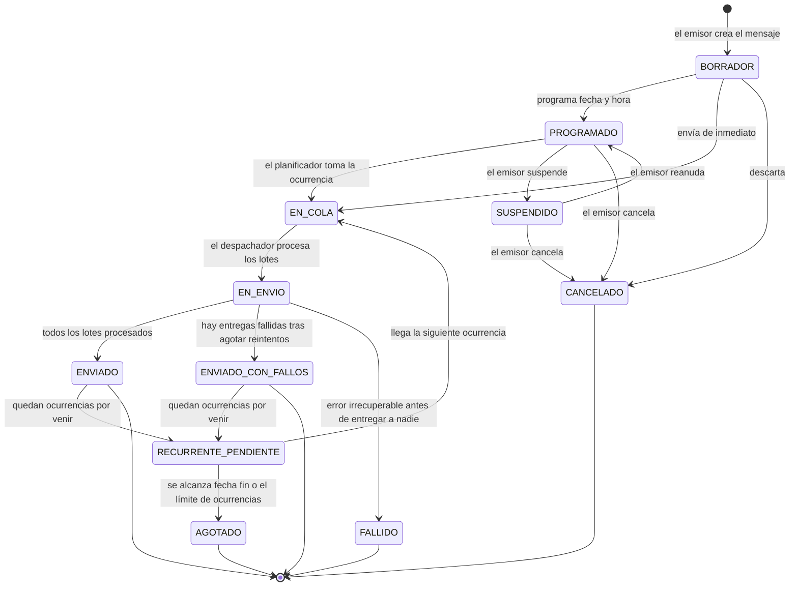
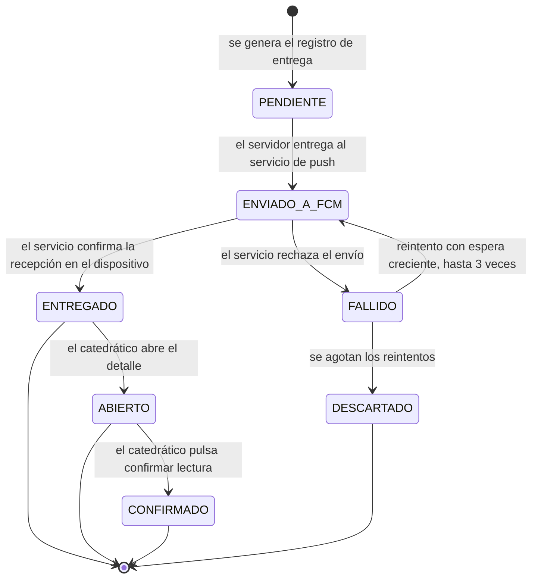

# 01 — Levantamiento de requerimientos

**Proyecto:** SIAN — Sistema Institucional de Avisos y Notificaciones
**Versión del documento:** 1.0
**Fecha:** 2 de agosto de 2026
**Estado:** Para revisión y aprobación del coordinador académico

---

## 1. Propósito y alcance

### 1.1 Propósito

Dotar a la coordinación académica de un canal propio, inmediato y auditable para hacer
llegar avisos y alertas a los catedráticos, sustituyendo el uso disperso de correo
electrónico y mensajería informal, que hoy no garantiza entrega, no deja rastro verificable
y no distingue lo urgente de lo informativo.

### 1.2 Alcance incluido (versión 1)

- Emisión de avisos **informativos** y alertas **urgentes** (por ejemplo, simulacros).
- Contenido de **texto**, **nota de voz** grabada por el emisor e **imagen** adjunta.
- Entrega push con **sonido, vibración y alerta visual**, según lo que permita cada
  plataforma.
- **Envío inmediato**, **envío programado** a fecha y hora exactas, y **envío recurrente**
  con patrón de repetición.
- **Confirmación de lectura** configurable por mensaje.
- **Bitácora de trazabilidad** completa, consultable y exportable.
- **Autenticación** con cuenta institucional de Google y con correo/contraseña.
- **Panel web de administración** y **aplicación PWA** para catedráticos.

### 1.3 Alcance excluido (versión 1)

| Exclusión | Razón |
|-----------|-------|
| Publicación en Google Play y App Store | Requisito explícito del solicitante: sin tiendas |
| Mensajería bidireccional (chat, respuestas libres) | No es un requerimiento; convertiría el sistema en una plataforma de conversación |
| Envío por SMS o WhatsApp | Costo por mensaje, fuera del presupuesto cero |
| Integración con el sistema académico existente | No se ha definido ni se dispone de sus interfaces |
| Texto a voz automático | Descartado para evitar dependencia de costo variable |
| Segmentación geográfica o por ubicación | Fuera de la necesidad planteada |

### 1.4 Definiciones

| Término | Significado en este documento |
|---------|-------------------------------|
| **Aviso** | Mensaje de carácter informativo, sin urgencia |
| **Alerta** | Mensaje urgente que exige atención inmediata (simulacro, emergencia, suspensión) |
| **Emisor** | Usuario con permiso para crear y enviar mensajes |
| **Destinatario** | Catedrático que recibe el mensaje |
| **Entrega** | Registro individual del estado de un mensaje respecto a un destinatario |
| **Ocurrencia** | Cada ejecución concreta de un mensaje recurrente |
| **Confirmación de lectura** | Acción explícita del catedrático que declara haber leído el mensaje |
| **Bitácora** | Registro inmutable y cronológico de eventos del sistema |
| **PWA** | Aplicación web progresiva, instalable en la pantalla de inicio sin pasar por tiendas |
| **FCM** | Firebase Cloud Messaging, servicio de entrega de notificaciones push |

---

## 2. Actores y roles

### 2.1 Actores

| Actor | Descripción |
|-------|-------------|
| **Coordinador Académico** | Máxima autoridad funcional. Emite mensajes de cualquier tipo, administra usuarios y roles, consulta toda la bitácora |
| **Administradora Académica** | Personal administrativo autorizado. Emite mensajes dentro de los límites que le fije el coordinador |
| **Catedrático** | Receptor de mensajes. Consulta su historial y confirma lectura |
| **Auditor** | Perfil de solo lectura sobre la bitácora, sin poder emitir mensajes |
| **Planificador (sistema)** | Actor no humano. Dispara los mensajes programados y recurrentes en el momento definido |

### 2.2 Matriz de permisos (RBAC)

| Permiso | Coordinador | Administradora | Catedrático | Auditor |
|---------|:---:|:---:|:---:|:---:|
| Crear y enviar aviso informativo | Sí | Sí | No | No |
| Crear y enviar alerta urgente | Sí | Según autorización | No | No |
| Adjuntar voz e imagen | Sí | Sí | No | No |
| Programar envío a fecha y hora | Sí | Sí | No | No |
| Crear mensaje recurrente | Sí | Según autorización | No | No |
| Cancelar o suspender programación | Sí | Solo lo propio | No | No |
| Exigir confirmación de lectura | Sí | Sí | No | No |
| Ver reporte de entregas de un mensaje | Sí | Solo lo propio | No | Sí |
| Ver bitácora completa | Sí | No | No | Sí |
| Administrar usuarios y roles | Sí | No | No | No |
| Administrar grupos de destinatarios | Sí | Sí | No | No |
| Recibir notificaciones | Opcional | Opcional | Sí | No |
| Confirmar lectura | Sí | Sí | Sí | No |
| Ver historial propio de mensajes recibidos | Sí | Sí | Sí | No |

> **RN-01.** La matriz anterior es la única fuente de verdad de autorización. Se implementa
> en tres puntos que deben coincidir: *custom claims* del token de autenticación, reglas de
> seguridad de la base de datos, y validación del lado del servidor en las funciones. Una
> comprobación únicamente en la interfaz se considera defecto de seguridad.

---

## 3. Requisitos funcionales

Notación: `RF-<módulo>-<número>`. Prioridad según MoSCoW —
**D** = Debe (bloquea el prototipo), **B** = Debería, **P** = Podría.

### 3.1 Módulo AUT — Autenticación y autorización

| ID | Requisito | Prioridad |
|----|-----------|:---:|
| RF-AUT-01 | El sistema permite iniciar sesión con cuenta de Google mediante OAuth 2.0 | D |
| RF-AUT-02 | El sistema permite registro e inicio de sesión con correo electrónico y contraseña | D |
| RF-AUT-03 | El sistema restringe el acceso a correos previamente autorizados en la lista institucional, sea cual sea el proveedor de identidad | D |
| RF-AUT-04 | El sistema asigna a cada usuario exactamente un rol, y lo refleja en el token de sesión | D |
| RF-AUT-05 | El sistema permite recuperar la contraseña por correo electrónico | D |
| RF-AUT-06 | El sistema exige contraseña de mínimo 10 caracteres con al menos una mayúscula, una minúscula, un dígito y un símbolo; y rechaza además las que contienen datos personales del propio usuario, las de uso común y las secuencias o repeticiones obvias | D |
| RF-AUT-07 | El sistema cierra sesión de forma explícita y revoca el token del dispositivo | D |
| RF-AUT-08 | El coordinador puede desactivar una cuenta sin borrarla, conservando su historial | D |
| RF-AUT-09 | El sistema bloquea el acceso tras 5 intentos fallidos consecutivos durante 15 minutos | B |
| RF-AUT-10 | El sistema permite verificación en dos pasos para cuentas con rol Coordinador | P |

**Criterio de aceptación de RF-AUT-06:** una contraseña que contenga el nombre o el correo de
quien la elige se rechaza, aunque cumpla longitud y composición, y aunque el fragmento venga
disfrazado con sustituciones del tipo `3` por `e`. El sistema informa de **todos** los
incumplimientos a la vez, no de uno cada vez.

**Criterio de aceptación de RF-AUT-03:** un usuario con correo no incluido en la lista de
autorizados que complete correctamente el flujo de Google recibe un rechazo explicativo, no
se le crea perfil, y el intento queda registrado en la bitácora.

### 3.2 Módulo USR — Usuarios y destinatarios

| ID | Requisito | Prioridad |
|----|-----------|:---:|
| RF-USR-01 | El coordinador puede registrar la lista de correos institucionales autorizados, individualmente o por carga masiva desde archivo CSV | D |
| RF-USR-02 | El coordinador puede asignar y cambiar el rol de cualquier usuario | D |
| RF-USR-03 | El sistema permite crear grupos de destinatarios con nombre y descripción | D |
| RF-USR-04 | El sistema permite agregar y quitar catedráticos de un grupo | D |
| RF-USR-05 | Un catedrático puede pertenecer a varios grupos simultáneamente | D |
| RF-USR-06 | El emisor puede dirigir un mensaje a: todos los catedráticos, uno o más grupos, o una selección individual | D |
| RF-USR-07 | El sistema muestra el conteo de destinatarios resueltos antes de confirmar el envío | D |
| RF-USR-08 | El catedrático puede consultar y actualizar sus datos de perfil, salvo su correo y su rol | B |
| RF-USR-09 | El sistema registra cada dispositivo desde el que un usuario se conecta, con su identificador de notificación | D |
| RF-USR-10 | El sistema depura automáticamente los identificadores de dispositivo rechazados por el servicio de push | B |

### 3.3 Módulo MSG — Composición de mensajes

| ID | Requisito | Prioridad |
|----|-----------|:---:|
| RF-MSG-01 | El emisor puede redactar un mensaje con título y cuerpo de texto | D |
| RF-MSG-02 | El emisor debe clasificar cada mensaje como **Informativo** o **Urgente** | D |
| RF-MSG-03 | El emisor puede adjuntar una nota de voz grabada desde el propio panel | D |
| RF-MSG-04 | El emisor puede adjuntar una imagen | D |
| RF-MSG-05 | El sistema admite mensajes mixtos (texto + voz, texto + imagen, o los tres) | D |
| RF-MSG-06 | El sistema valida que el título no exceda 80 caracteres y el cuerpo 500 caracteres | D |
| RF-MSG-07 | El sistema valida que la nota de voz no exceda 60 segundos ni 2 MB | D |
| RF-MSG-08 | El sistema valida que la imagen no exceda 5 MB y sea JPEG, PNG o WebP | D |
| RF-MSG-09 | El sistema comprime la imagen del lado del cliente antes de subirla | B |
| RF-MSG-10 | El emisor puede guardar un mensaje como borrador y retomarlo después | B |
| RF-MSG-11 | El emisor puede previsualizar cómo se verá la notificación antes de enviar | B |
| RF-MSG-12 | El emisor puede marcar el mensaje como **requiere confirmación de lectura** | D |
| RF-MSG-13 | El sistema exige una segunda confirmación explícita antes de enviar una alerta urgente | D |
| RF-MSG-14 | El emisor puede usar plantillas predefinidas para mensajes frecuentes, como simulacros | P |

**Criterio de aceptación de RF-MSG-13:** al pulsar «Enviar» en un mensaje clasificado como
Urgente, el sistema presenta un diálogo que muestra el conteo exacto de destinatarios y
exige una acción adicional distinta del botón inicial. Cancelar deja el mensaje en borrador.

### 3.4 Módulo PRG — Programación y recurrencia

| ID | Requisito | Prioridad |
|----|-----------|:---:|
| RF-PRG-01 | El emisor puede enviar el mensaje de inmediato | D |
| RF-PRG-02 | El emisor puede programar el mensaje para una fecha y hora futuras específicas | D |
| RF-PRG-03 | El sistema interpreta y almacena todas las fechas en la zona horaria institucional configurada, y las guarda internamente en UTC | D |
| RF-PRG-04 | El sistema rechaza una programación cuya fecha y hora ya pasaron | D |
| RF-PRG-05 | El emisor puede definir un mensaje recurrente indicando fecha de inicio, fecha de fin e intervalo de repetición | D |
| RF-PRG-06 | El patrón de recurrencia admite intervalo expresado en minutos, horas o días | D |
| RF-PRG-07 | El patrón de recurrencia admite restringir el envío a días específicos de la semana | D |
| RF-PRG-08 | El patrón de recurrencia admite restringir el envío a una franja horaria diaria | B |
| RF-PRG-09 | El sistema muestra al emisor las próximas 10 ocurrencias calculadas antes de guardar la recurrencia | D |
| RF-PRG-10 | El emisor puede suspender temporalmente una recurrencia sin eliminarla | D |
| RF-PRG-11 | El emisor puede cancelar definitivamente una programación pendiente | D |
| RF-PRG-12 | El sistema garantiza que una ocurrencia no se envíe dos veces, aun si el planificador se ejecuta de forma duplicada | D |
| RF-PRG-13 | Si el sistema estuvo caído al llegar la hora de una ocurrencia, la despacha al recuperarse siempre que el retraso sea menor a la tolerancia configurada; si la excede, la marca como omitida y lo registra | D |
| RF-PRG-14 | El sistema aplica un límite máximo de ocurrencias por recurrencia como salvaguarda contra bucles de envío | D |
| RF-PRG-15 | El emisor puede editar un mensaje programado mientras no haya sido despachado | B |

**Criterio de aceptación de RF-PRG-12:** dos ejecuciones simultáneas del planificador sobre
la misma ocurrencia producen exactamente un envío. Se verifica con una prueba de integración
que invoque el despachador dos veces en paralelo y compruebe que el número de entregas
generadas es igual al número de destinatarios, no al doble.

**Criterio de aceptación de RF-PRG-14:** el límite por defecto es 500 ocurrencias por
mensaje recurrente. Al alcanzarlo, la recurrencia se detiene, se marca como agotada y se
notifica a su creador.

### 3.5 Módulo ENT — Entrega y notificación

| ID | Requisito | Prioridad |
|----|-----------|:---:|
| RF-ENT-01 | El sistema entrega la notificación a todos los dispositivos activos de cada destinatario | D |
| RF-ENT-02 | La notificación llega con alerta sonora en las plataformas que lo permiten | D |
| RF-ENT-03 | La notificación llega con vibración en las plataformas que lo permiten | D |
| RF-ENT-04 | La notificación siempre presenta alerta visual, en toda plataforma soportada | D |
| RF-ENT-05 | Las alertas urgentes usan un canal de máxima prioridad, distinguible de los avisos informativos | D |
| RF-ENT-06 | El sistema entrega la notificación con la aplicación cerrada o en segundo plano | D |
| RF-ENT-07 | Al abrir la notificación, la aplicación muestra el mensaje completo con sus adjuntos | D |
| RF-ENT-08 | El catedrático puede reproducir la nota de voz desde el detalle del mensaje | D |
| RF-ENT-09 | El catedrático puede ver la imagen adjunta ampliada | D |
| RF-ENT-10 | El sistema reintenta la entrega fallida hasta 3 veces con espera creciente | D |
| RF-ENT-11 | El sistema registra el resultado individual de cada intento de entrega | D |
| RF-ENT-12 | El catedrático consulta el historial completo de mensajes recibidos, ordenado del más reciente al más antiguo | D |
| RF-ENT-13 | La aplicación muestra un contador de mensajes no leídos | B |
| RF-ENT-14 | El envío se procesa por lotes para no exceder los límites del servicio de push | D |
| RF-ENT-15 | El sistema muestra al emisor el avance del envío en tiempo real | B |

**Criterio de aceptación de RF-ENT-05:** en Android, avisos y alertas usan canales de
notificación distintos con importancia `DEFAULT` y `HIGH` respectivamente. En iOS-PWA, donde
no es posible definir canales, la distinción se hace por prefijo visible en el título y por
tratamiento diferenciado dentro de la aplicación. Esta diferencia queda registrada como
deuda técnica DT-02.

### 3.6 Módulo CNF — Confirmación de lectura

| ID | Requisito | Prioridad |
|----|-----------|:---:|
| RF-CNF-01 | Cuando el mensaje lo exige, la aplicación presenta un control explícito de confirmación de lectura | D |
| RF-CNF-02 | El sistema distingue tres estados diferentes: **entregado**, **abierto** y **confirmado** | D |
| RF-CNF-03 | La confirmación registra el identificador del catedrático, la fecha y hora exactas, y el dispositivo desde el que se confirmó | D |
| RF-CNF-04 | La confirmación es irreversible: no puede deshacerse ni editarse | D |
| RF-CNF-05 | El sistema impide confirmaciones duplicadas del mismo usuario sobre el mismo mensaje | D |
| RF-CNF-06 | El emisor consulta en cualquier momento quién ha confirmado y quién no | D |
| RF-CNF-07 | El sistema muestra el porcentaje de confirmación sobre el total de destinatarios | D |
| RF-CNF-08 | El emisor puede reenviar el mensaje únicamente a quienes no han confirmado | B |
| RF-CNF-09 | El sistema puede recordar automáticamente a los no confirmados tras un plazo definido | P |
| RF-CNF-10 | La aplicación insiste visualmente en los mensajes urgentes pendientes de confirmar hasta que se confirmen | B |

**Criterio de aceptación de RF-CNF-02:** *entregado* lo registra el servidor al recibir el
acuse del servicio de push. *Abierto* lo registra la aplicación cuando el catedrático abre
el detalle del mensaje. *Confirmado* solo lo registra una acción deliberada del usuario
sobre el control de confirmación. Abrir un mensaje nunca lo marca como confirmado.

### 3.7 Módulo BIT — Bitácora y trazabilidad

| ID | Requisito | Prioridad |
|----|-----------|:---:|
| RF-BIT-01 | El sistema registra en bitácora todo evento relevante: inicio y cierre de sesión, creación, edición, envío, programación, cancelación, entrega, apertura y confirmación | D |
| RF-BIT-02 | Cada asiento de bitácora guarda: tipo de evento, actor, rol del actor, entidad afectada, fecha y hora en UTC, y resumen del cambio | D |
| RF-BIT-03 | La bitácora es de solo escritura para la aplicación: ningún cliente puede modificar ni eliminar asientos | D |
| RF-BIT-04 | Solo Coordinador y Auditor pueden consultar la bitácora completa | D |
| RF-BIT-05 | La bitácora es filtrable por rango de fechas, tipo de evento, actor y mensaje | D |
| RF-BIT-06 | El sistema exporta el resultado de una consulta de bitácora a CSV | B |
| RF-BIT-07 | Cada mensaje tiene una vista de trazabilidad que muestra su ciclo de vida completo | D |
| RF-BIT-08 | La vista de trazabilidad detalla, por destinatario, el estado y las marcas de tiempo de cada transición | D |
| RF-BIT-09 | El sistema conserva la bitácora un mínimo de 24 meses | D |
| RF-BIT-10 | Cada asiento incluye un encadenamiento por resumen criptográfico con el asiento anterior, para detectar manipulación | P |

### 3.8 Módulo ADM — Administración y configuración

| ID | Requisito | Prioridad |
|----|-----------|:---:|
| RF-ADM-01 | El coordinador configura la zona horaria institucional | D |
| RF-ADM-02 | El coordinador configura la tolerancia de retraso para ocurrencias atrasadas | D |
| RF-ADM-03 | El coordinador configura el límite máximo de ocurrencias por recurrencia | B |
| RF-ADM-04 | El panel presenta un tablero con métricas: mensajes enviados, tasa de entrega y tasa de confirmación | B |
| RF-ADM-05 | El sistema notifica al emisor cuando un envío termina con fallos por encima de un umbral | P |

---

## 4. Requisitos no funcionales

| ID | Categoría | Requisito | Verificación |
|----|-----------|-----------|--------------|
| RNF-01 | Rendimiento | El despacho de una alerta urgente a 100 destinatarios se completa en menos de 30 segundos desde la confirmación del emisor | Prueba de carga con 100 cuentas simuladas |
| RNF-02 | Rendimiento | El panel carga la vista inicial en menos de 3 segundos en conexión de 4 Mbps | Medición con Lighthouse |
| RNF-03 | Rendimiento | La PWA del catedrático carga en menos de 5 segundos en la primera visita y menos de 2 en las siguientes | Medición con Lighthouse |
| RNF-04 | Precisión temporal | Una ocurrencia programada se despacha con una desviación máxima de 60 segundos respecto a su hora prevista | Registro comparado de hora prevista contra hora real de ejecución |
| RNF-05 | Disponibilidad | Disponibilidad objetivo del 99% mensual, limitada por la que ofrezcan los servicios de Firebase | Monitoreo |
| RNF-06 | Fiabilidad | Ninguna ocurrencia se envía por duplicado, bajo ninguna condición de reejecución | Prueba de concurrencia |
| RNF-07 | Seguridad | Toda comunicación viaja cifrada sobre TLS 1.2 o superior | Inspección |
| RNF-08 | Seguridad | Ningún cliente puede leer datos de otro usuario ni escribir fuera de su ámbito | Pruebas automatizadas contra las reglas de seguridad |
| RNF-09 | Seguridad | Los archivos de voz e imagen solo son accesibles a destinatarios del mensaje y a su emisor | Prueba de acceso con cuenta no destinataria |
| RNF-10 | Seguridad | Ninguna credencial, clave ni secreto se versiona en el repositorio | Análisis de secretos en la integración continua |
| RNF-11 | Privacidad | Se recopilan únicamente los datos necesarios para operar el servicio | Revisión de modelo de datos |
| RNF-12 | Usabilidad | Un emisor sin capacitación previa envía su primer aviso en menos de 3 minutos | Prueba con usuarios reales en fase QA |
| RNF-13 | Accesibilidad | Contraste y tamaños de texto conformes a WCAG 2.1 nivel AA | Auditoría automatizada más revisión manual |
| RNF-14 | Compatibilidad | Funciona en Android 10 o superior, iOS 16.4 o superior, y en los navegadores Chrome, Edge, Firefox y Safari en sus dos últimas versiones estables | Matriz de pruebas |
| RNF-15 | Mantenibilidad | Cobertura de pruebas unitarias mayor o igual al 70% en la capa de dominio y aplicación | Reporte de cobertura en la integración continua |
| RNF-16 | Mantenibilidad | Cero advertencias del analizador estático en la rama principal | Verificación en la integración continua |
| RNF-17 | Trazabilidad | Todo cambio de estado de un mensaje deja asiento en bitácora, sin excepción | Revisión de código y pruebas |
| RNF-18 | Costo | El consumo mensual proyectado no supera las cuotas gratuitas incluidas en el plan Blaze | Alerta de presupuesto configurada en 1 USD |
| RNF-19 | Portabilidad | La lógica de dominio no depende de Firebase y puede migrar a otro proveedor sin reescribirla | Revisión de dependencias por capa |
| RNF-20 | Operación | Cualquier persona puede replicar el sistema completo siguiendo únicamente la documentación del repositorio | Prueba de replicación por un tercero |
| RNF-21 | Internacionalización | La interfaz está en español; los textos residen en archivos de recursos, no incrustados en el código | Revisión de código |
| RNF-22 | Escalabilidad | El diseño soporta hasta 500 catedráticos sin cambio de arquitectura | Análisis de límites por lote de envío |

---

## 5. Reglas de negocio

| ID | Regla |
|----|-------|
| RN-01 | La autorización se valida en el servidor y en las reglas de la base de datos, nunca solo en la interfaz |
| RN-02 | Solo puede recibir mensajes quien tenga cuenta activa y al menos un dispositivo registrado |
| RN-03 | Un mensaje enviado no puede editarse ni borrarse; solo puede emitirse una corrección como mensaje nuevo que lo referencie |
| RN-04 | La confirmación de lectura es un acto personal e irreversible del catedrático |
| RN-05 | Toda fecha y hora se almacena en UTC y se presenta en la zona horaria institucional |
| RN-06 | Una alerta urgente exige doble confirmación del emisor antes de salir |
| RN-07 | Un mensaje recurrente genera una ocurrencia independiente por cada disparo, con su propia trazabilidad |
| RN-08 | Cancelar una recurrencia no elimina el historial de las ocurrencias ya enviadas |
| RN-09 | Los adjuntos de un mensaje se conservan mientras exista el mensaje en la bitácora |
| RN-10 | Un usuario desactivado deja de recibir mensajes pero conserva íntegro su historial |
| RN-11 | La bitácora nunca se depura antes del período mínimo de conservación |
| RN-12 | Ningún emisor puede consultar la bitácora de mensajes que no emitió, salvo Coordinador y Auditor |

---

## 6. Restricciones

| ID | Restricción | Consecuencia de diseño |
|----|-------------|------------------------|
| RES-01 | Sin publicación en tiendas de aplicaciones | La aplicación del catedrático se distribuye como PWA instalable desde el navegador |
| RES-02 | Sin alojamiento pagado propio | Todo se apoya en Firebase; no hay servidores administrados por el equipo |
| RES-03 | Cloud Functions, Cloud Storage y Cloud Scheduler exigen plan Blaze con cuenta de facturación | Se activa Blaze y se configura alerta de presupuesto; el consumo proyectado se mantiene dentro de las cuotas gratuitas |
| RES-04 | Cloud Scheduler incluye solo 3 jobs gratuitos por cuenta de facturación | Se usa exactamente 1 job por ambiente (dev, qa, prod) que consume una cola en base de datos, en lugar de un job por mensaje |
| RES-05 | En iOS, las notificaciones web solo funcionan si la PWA se instala en la pantalla de inicio y el dispositivo tiene iOS 16.4 o superior | Se incorpora un instructivo de instalación obligatorio en el primer acceso desde iOS |
| RES-06 | En iOS-PWA no es posible definir sonido personalizado ni vibración programada | Las alertas urgentes se distinguen visualmente; queda registrado como deuda técnica DT-02 |
| RES-07 | El usuario debe conceder permiso de notificaciones de forma explícita | El sistema detecta el permiso denegado y guía su corrección |
| RES-08 | Escala pequeña: decenas de usuarios, no miles | Se permiten decisiones simples y se documenta el umbral en que dejarían de servir |
| RES-09 | El branding institucional lo provee el propietario del proyecto | El prototipo usa marcadores de posición neutros hasta recibirlo |
| RES-10 | El repositorio es público | Ninguna clave, secreto ni dato personal puede versionarse |

---

## 7. Supuestos

| ID | Supuesto | Riesgo si resulta falso |
|----|----------|-------------------------|
| SUP-01 | Los catedráticos poseen teléfono inteligente con Android 10+ o iOS 16.4+ | Quien no lo tenga queda fuera del canal; requeriría un respaldo por correo |
| SUP-02 | La universidad dispone de correos institucionales asociados a Google Workspace | Se usaría exclusivamente el registro con correo y contraseña |
| SUP-03 | El propietario del proyecto puede activar el plan Blaze con una tarjeta válida | Se perdería programación, recurrencia y adjuntos; el alcance se reduciría a envío inmediato de texto |
| SUP-04 | Los catedráticos aceptarán instalar la PWA en su pantalla de inicio | En iOS no habría notificaciones push; sería el mayor riesgo de adopción del proyecto |
| SUP-05 | El volumen se mantiene en el orden de decenas de mensajes al mes | Un volumen mucho mayor podría generar costo real en Firestore y Cloud Functions |
| SUP-06 | Existe una única zona horaria institucional | Un patrón recurrente multi-sede exigiría rediseñar la programación |

---

## 8. Casos de uso principales

| ID | Caso de uso | Actor principal | Requisitos que cubre |
|----|-------------|-----------------|----------------------|
| CU-01 | Iniciar sesión con cuenta institucional de Google | Coordinador, Administradora, Catedrático | RF-AUT-01, 03, 04 |
| CU-02 | Registrarse con correo y contraseña | Catedrático | RF-AUT-02, 03, 05, 06 |
| CU-03 | Emitir alerta urgente de simulacro con voz e imagen | Coordinador | RF-MSG-02..13, RF-ENT-01..06 |
| CU-04 | Programar un aviso para fecha y hora específicas | Administradora | RF-PRG-02, 03, 04, 11 |
| CU-05 | Crear un aviso recurrente con patrón de repetición | Coordinador | RF-PRG-05..14 |
| CU-06 | Recibir y abrir una notificación | Catedrático | RF-ENT-04..09 |
| CU-07 | Confirmar lectura de un mensaje | Catedrático | RF-CNF-01..05 |
| CU-08 | Consultar quién confirmó y quién no | Coordinador, Administradora | RF-CNF-06, 07, RF-BIT-07, 08 |
| CU-09 | Auditar la bitácora del sistema | Auditor | RF-BIT-01..06 |
| CU-10 | Administrar usuarios, roles y grupos | Coordinador | RF-USR-01..06 |
| CU-11 | Suspender o cancelar una programación | Coordinador, Administradora | RF-PRG-10, 11 |
| CU-12 | Despachar automáticamente las ocurrencias vencidas | Planificador | RF-PRG-12, 13, RF-ENT-14 |

> **Este catálogo es el índice, no la especificación.** Cada caso está
> desarrollado en el [documento 10](10-casos-de-uso.md) con el formato extendido
> de la norma **ISO/IEC/IEEE 29148:2018**: actores, partes interesadas,
> precondiciones, garantía mínima y de éxito, flujo principal, flujos
> alternativos, excepciones y reglas de negocio.

---

## 9. Estados del mensaje

## 10. Estados de la entrega individual

---

## 11. Matriz de trazabilidad

| Necesidad expresada por el solicitante | Requisitos que la satisfacen | Caso de uso |
|---|---|---|
| Avisos informativos y alertas urgentes | RF-MSG-02, RF-ENT-05, RN-06 | CU-03 |
| Mensajes de texto, voz e imagen | RF-MSG-01, 03, 04, 05 | CU-03 |
| Sonido, vibración o alerta visible | RF-ENT-02, 03, 04, 05 | CU-06 |
| Funcionamiento igual en Android e iOS | RNF-14, RES-05, RES-06, DT-02 | CU-06 |
| Roles definidos para administradoras | RF-AUT-04, matriz RBAC, RN-01 | CU-10 |
| Mensajes programados a fecha y hora | RF-PRG-02, 03, 04 | CU-04 |
| Mensajes recurrentes con rango e intervalo | RF-PRG-05, 06, 07, 08, 09 | CU-05 |
| Planificador que dispara automáticamente | RF-PRG-12, 13, RNF-04, RES-04 | CU-12 |
| Trazabilidad completa | RF-BIT-01..09, RNF-17 | CU-08, CU-09 |
| Confirmación de lectura configurable | RF-MSG-12, RF-CNF-01..07 | CU-07 |
| Inicio de sesión con Google institucional | RF-AUT-01, 03 | CU-01 |
| Registro con correo y contraseña | RF-AUT-02, 05, 06 | CU-02 |
| Escala pequeña sin alojamiento pagado | RES-02, 03, 04, RNF-18 | — |
| Estándares de ingeniería de software | RNF-15, 16, 19, 20, documento 02 | — |
| Copia local antes de desplegar | Documento 06, sección 2 | — |
| Repositorio público replicable | RNF-20, RES-10, documento 06 | — |
| Deuda técnica registrada | Documento 07 | — |

---

## 12. Aprobación

| Rol | Nombre | Firma | Fecha |
|-----|--------|-------|-------|
| Solicitante / Propietario del producto | Ezequiel Urízar | | |
| Coordinador Académico | | | |
| Responsable técnico | | | |

> Este documento se considera línea base al ser aprobado. Todo cambio posterior requiere
> nueva versión y queda registrado en el historial del repositorio.
