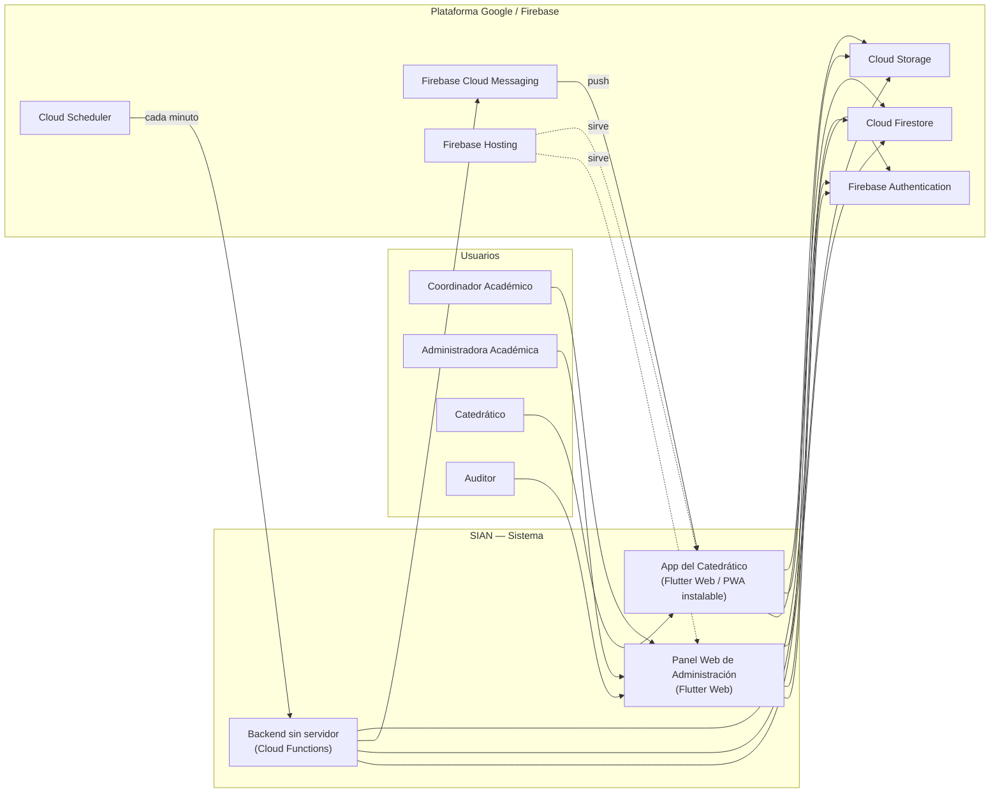
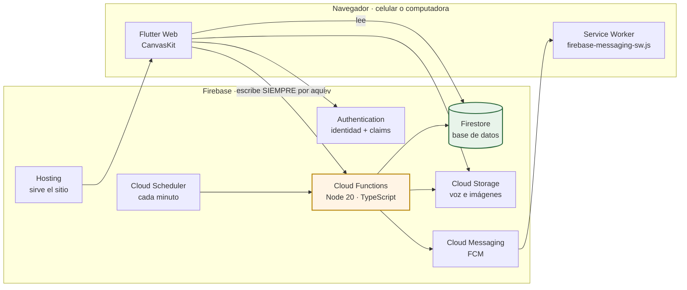
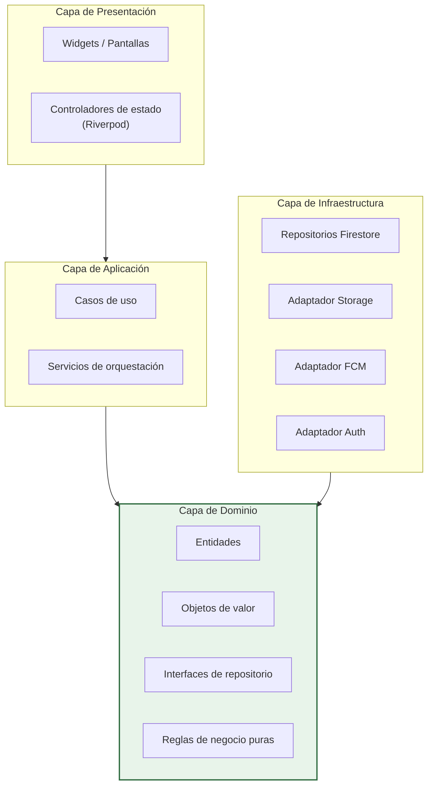
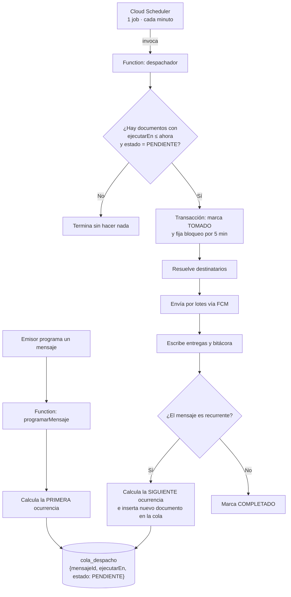
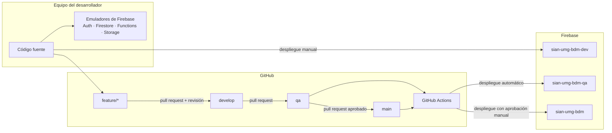

# 02 — Arquitectura y diseño

**Proyecto:** SIAN — Sistema Institucional de Avisos y Notificaciones
**Versión:** 1.0 · 2 de agosto de 2026

---

## 1. Vista de contexto



**Lectura del diagrama.** Los clientes leen datos directamente de Firestore, protegidos por
reglas de seguridad. Toda **escritura sensible** —enviar, programar, confirmar, auditar— pasa
obligatoriamente por Cloud Functions. Ningún cliente escribe jamás en la bitácora ni en la
cola de despacho.

---

## 2. Qué tecnología se usó, para qué, y cómo encaja

> Los datos de esta sección se comprobaron contra el proyecto desplegado el
> **11 de agosto de 2026**, no contra la memoria de nadie. Los comandos para
> volver a comprobarlos están en la sección 6.

### 2.1 La respuesta corta, por capa

Si lo que se busca es **qué se usó para cada cosa**, es esta tabla. Cada fila
se desarrolla más abajo.

| Capa | Tecnología | Versión | Dónde está en el repositorio |
|---|---|---|---|
| **Frontend** | Flutter Web (motor CanvasKit) · Dart | 3.44.8 · 3.12.2 | `app/lib/presentation/` |
| **Estado del frontend** | Riverpod | 3.4.2 | `app/lib/application/` |
| **Backend** | Cloud Functions v2 · Node.js · TypeScript | 6.6.0 · 20 · 5.9.3 | `functions/src/` |
| **Base de datos** | Cloud Firestore, modo Native — **NoSQL documental** | — | `firestore.rules`, `firestore.indexes.json` |
| **Seguridad · identidad** | Firebase Authentication con *custom claims* | 6.5.6 | `functions/src/triggers/activarSesion.ts` |
| **Seguridad · autorización** | Reglas de Firestore y de Storage, evaluadas por el servidor | — | `firestore.rules`, `storage.rules` |
| **Seguridad · reglas de negocio** | Dominio puro en TypeScript, del lado del servidor | — | `functions/src/domain/` |
| **Notificaciones** | Firebase Cloud Messaging + Service Worker propio | 16.4.3 | `app/web/firebase-messaging-sw.js` |
| **Almacenamiento de archivos** | Cloud Storage | 13.4.5 | `app/lib/infrastructure/firebase/repositorio_adjuntos.dart` |
| **Planificación** | Cloud Scheduler → Cloud Function cada minuto | — | `functions/src/triggers/despachador.ts` |
| **Alojamiento** | Firebase Hosting | — | `firebase.json` |
| **Integración continua** | GitHub Actions, cuatro trabajos | — | `.github/workflows/` |
| **Pruebas** | `flutter_test` · Jest · `@firebase/rules-unit-testing` | — | `app/test/`, `functions/test/` |

**La seguridad no es una capa aparte, son tres cosas a la vez**, y conviene
verlas juntas porque cada una tapa un hueco distinto:

| Nivel | Qué impide | Dónde se decide |
|---|---|---|
| **Identidad** | Que entre alguien que no está en la lista blanca | `activarSesion`, contra la colección `invitaciones` |
| **Autorización** | Que alguien lea o escriba lo que no le toca, aunque llame a la base directamente desde la consola del navegador | Reglas de Firestore y Storage — **las evalúa Google, no el cliente** |
| **Reglas de negocio** | Que salga una alerta urgente sin doble confirmación, o un mensaje de 19 MB | Dominio en TypeScript, dentro de las Functions |

Ninguno de los tres confía en la interfaz. Lo que el panel comprueba antes de
enviar es cortesía —avisar temprano—, no seguridad: la Function vuelve a
comprobarlo todo, porque quien llame a la Function directamente se saltaría el
diálogo.

### 2.2 El resumen en una frase

Una **aplicación Flutter compilada a web**, servida como sitio estático, que
habla con **Firebase** para todo lo demás: identidad, base de datos,
notificaciones, archivos y la lógica que no puede vivir en el navegador.

No hay servidor propio. No hay contenedores. No hay nada que administrar entre
el navegador de un catedrático y los servicios de Google.



**La flecha que define el sistema es la segunda.** El navegador *lee* de
Firestore directamente, pero **nunca escribe**: toda escritura pasa por una
Cloud Function. Las reglas de seguridad lo hacen literal —
`allow write: if false` en las colecciones que importan— porque una regla que
solo viva en el cliente no es una regla, es una sugerencia.

### 2.3 Framework de la interfaz

| | |
|---|---|
| **Qué es** | Flutter 3.44.8 · Dart 3.12.2, compilado a web con el motor CanvasKit |
| **Para qué aquí** | Una sola base de código para celular y computadora, instalable como aplicación sin pasar por App Store ni Play Store |
| **Dónde vive** | `app/lib/` |
| **Por qué** | ADR-003. Publicar en tiendas exigía cuentas de desarrollador de pago y revisiones de días por cada corrección; con una aplicación web instalable, un arreglo urgente llega en el siguiente despliegue |

**Sí se usa un framework**, y esto responde a la pregunta directamente: la
interfaz no está hecha con HTML y JavaScript sueltos. Flutter dibuja toda la
pantalla sobre un lienzo, que es la razón de que las capturas del manual se
generen desde el propio motor y no fotografiando el navegador.

### 2.4 Librerías de la aplicación

Once en total, y ninguna de adorno. Estas son **todas**:

| Librería | Versión | Para qué se usa aquí |
|---|---|---|
| `flutter_riverpod` | ^3.4.2 | Manejo de estado e inyección de dependencias. Es lo que permite cambiar un repositorio real por uno falso en las pruebas sin tocar la pantalla |
| `firebase_core` | ^4.12.1 | Arranque del SDK; lo exigen todos los demás |
| `firebase_auth` | ^6.5.6 | Ingreso con Google y con correo, y lectura de los *claims* que llevan el rol |
| `cloud_firestore` | ^6.7.1 | Lectura de la base de datos y suscripciones en tiempo real |
| `cloud_functions` | ^6.3.5 | Llamada a las Functions: el único camino de escritura |
| `firebase_messaging` | ^16.4.3 | Registro del dispositivo y recepción de notificaciones |
| `firebase_storage` | ^13.4.5 | Subida y descarga de notas de voz e imágenes |
| `web` | ^1.1.1 | Acceso tipado al navegador: `MediaRecorder` para grabar voz, `<input type=file>` para las imágenes, `<audio>` para reproducir |
| `intl` | ^0.20.3 | Fechas y horas en español y en la zona de Guatemala |
| `cupertino_icons` | ^1.0.8 | Iconos de la familia iOS |

**Lo que deliberadamente NO se usó**, porque la pregunta también se responde
por lo que falta:

| Se evitó | Por qué |
|---|---|
| Paquete para grabar audio | El navegador ya trae `MediaRecorder`. Un paquete traería su propia cadena de dependencias y su propio ritmo de actualizaciones a cambio de nada |
| Paquete para elegir archivos | `<input type="file">` hace exactamente eso, y en celular abre cámara o galería por sí solo |
| Reproductor de audio propio | El `<audio>` del navegador entiende tanto el formato de Safari como el de Chrome, y trae resueltos el teclado y el lector de pantalla |
| Generador de código (`build_runner`, `freezed`) | Añade una compilación intermedia a un proyecto que se lee para aprender |

### 2.5 El servidor: Cloud Functions

| | |
|---|---|
| **Qué es** | Cloud Functions de segunda generación, **Node.js 20**, escritas en **TypeScript 5.9** |
| **Para qué aquí** | Todo lo que no puede confiarse al navegador: crear mensajes, resolver destinatarios, despachar notificaciones, confirmar lecturas, administrar usuarios y roles |
| **Dónde vive** | `functions/src/` |
| **Cuántas hay** | 19 desplegadas y activas |

Sus tres únicas dependencias de ejecución:

| Librería | Versión | Para qué |
|---|---|---|
| `firebase-admin` | ^13.10.0 | Acceso privilegiado a Firestore, Auth, Storage y FCM, saltándose las reglas —que es justo lo que hace falta del lado del servidor— |
| `firebase-functions` | ^6.6.0 | Declaración de las funciones y sus disparadores |
| `luxon` | ^3.7.2 | Fechas con zona horaria. La única de las tres que se eligió: calcular «todos los martes a las 7:00 en Guatemala» a mano, con cambios de mes y años bisiestos, es exactamente la clase de problema que no se debe resolver dos veces |

Para probar y compilar: `jest`, `ts-jest`, `typescript`, `eslint` y
`@firebase/rules-unit-testing` —esta última levanta un emulador para verificar
que las reglas de seguridad hacen lo que dicen—.

### 2.6 La base de datos

| | |
|---|---|
| **Producto** | Cloud Firestore, en modo **Native** |
| **Tipo** | **NoSQL documental**. No es una base de datos relacional: no hay tablas, ni filas, ni `JOIN`, ni SQL |
| **Cómo se organiza** | Colecciones que contienen documentos; un documento puede tener subcolecciones dentro |
| **Instancia** | `(default)`, región `us-central1` |
| **Concurrencia** | Pesimista, con transacciones y bloqueos |

Las seis colecciones que existen hoy en el proyecto:

| Colección | Qué guarda |
|---|---|
| `usuarios` | Perfil de cada persona: nombre, correo, rol, si está activa, si recibe avisos |
| `invitaciones` | La lista blanca. Sin estar aquí, nadie puede crear cuenta |
| `grupos` | Conjuntos de destinatarios por carrera o jornada |
| `mensajes` | Cada aviso, con sus adjuntos y su lista de destinatarios |
| `cola_despacho` | Lo que está esperando salir. Es el corazón del planificador |
| `bitacora` | Quién hizo qué y cuándo. Solo se escribe; nunca se modifica |

Dentro de `mensajes` cuelgan dos subcolecciones: `ocurrencias` (cada vez que un
mensaje recurrente sale) y, dentro de cada una, `entregas` (una por
destinatario, con su estado y su confirmación).

**Por qué NoSQL y no una base relacional.** No fue una preferencia: Firestore
es lo que permite que el navegador **lea directamente** con reglas de seguridad
evaluadas por documento, y que la bandeja se actualice sola cuando llega un
aviso, sin preguntar cada cierto tiempo. Con una base relacional haría falta un
servidor propio delante, y con él, alguien que lo administre.

**Lo que cuesta esa decisión**, dicho sin adornos:

- No hay `JOIN`. Los datos que se muestran juntos se guardan juntos aunque se
  repitan: el nombre de quien envía viaja **dentro** del mensaje, porque el
  catedrático no tiene permiso para leer la lista de usuarios.
- Las consultas necesitan índices declarados de antemano. Los diez que usa el
  sistema están en `firestore.indexes.json`, versionados junto al código.
- **Una consulta no se recorta: se aprueba entera o se rechaza entera.** Esta
  es la que más cara sale de aprender. Provocó dos defectos reales —el panel
  del administrador y la bandeja del catedrático— y ambos aparecen explicados
  en el código, en el sitio exacto donde se equivocaron.

### 2.7 Los demás servicios, y para qué cada uno

| Servicio | Para qué se usa | Dónde se toca en el código |
|---|---|---|
| **Authentication** | Identidad, y los *claims* que llevan el rol dentro del token. El rol NO se lee de la base de datos al decidir permisos: viaja firmado en el token (RN-01) | `functions/src/triggers/activarSesion.ts` |
| **Hosting** | Sirve el sitio y el manual. Aquí viven también las reglas de caché | `firebase.json` |
| **Cloud Storage** | Notas de voz e imágenes. Se sube contra un identificador reservado *antes* de que el mensaje exista | `app/lib/infrastructure/firebase/repositorio_adjuntos.dart` |
| **Cloud Messaging** | La notificación que suena con la aplicación cerrada. Se envían mensajes **solo de datos** para que el Service Worker decida cómo mostrarlos | `app/web/firebase-messaging-sw.js` |
| **Cloud Scheduler** | Despierta al planificador cada minuto. Un solo trabajo para todo el sistema, no uno por mensaje | `functions/src/triggers/despachador.ts` |

### 2.8 Cómo encajan las capas con la tecnología

La arquitectura de la sección 3 no es un dibujo: se puede medir. Estas son las
líneas reales de cada capa, y lo que hay dentro:

| Capa | Líneas | Qué contiene | Qué NO puede contener |
|---|---|---|---|
| `app/lib/domain` | 618 | Reglas, entidades e interfaces | Ni una línea de Firebase |
| `app/lib/application` | 121 | Proveedores que conectan pantalla y datos | Lógica de negocio |
| `app/lib/infrastructure` | 2 120 | Los repositorios que sí hablan con Firebase | Reglas de negocio |
| `app/lib/presentation` | 9 424 | Pantallas y widgets | Acceso directo a Firebase |
| `functions/src/domain` | 2 495 | Las reglas críticas, puras | `import ... from 'firebase-admin'` |
| `functions/src/application` | 642 | Casos de uso puros | Acceso a la red |
| `functions/src/triggers` | 2 402 | Las Functions y su plomería | Reglas de negocio sin probar aparte |

Que el dominio esté limpio **es verificable**, no una promesa:

```bash
grep -rl "firebase" app/lib/domain functions/src/domain
```

Hoy devuelve un solo archivo, y es un comentario que prohíbe exactamente eso.

---

## 3. Estilo arquitectónico

**Clean Architecture con cuatro capas** y regla de dependencia estricta: las flechas de
dependencia apuntan siempre hacia adentro, hacia el dominio.



### Por qué así

| Objetivo | Cómo lo consigue esta arquitectura |
|----------|-----------------------------------|
| Portabilidad (RNF-19) | El dominio no importa una sola línea de Firebase. Migrar a otro proveedor solo cambia la capa de infraestructura |
| Testabilidad (RNF-15) | Las reglas de recurrencia, validación y transición de estados se prueban sin red, sin emulador y sin nube |
| Valor didáctico | Cada capa es una lección visible: dónde vive una regla de negocio, dónde un detalle técnico |
| Reutilización | El mismo dominio sirve al panel web, a la app del catedrático y a las Cloud Functions |

> **Nota sobre el dominio compartido.** El dominio se escribe dos veces —en Dart para Flutter
> y en TypeScript para las Functions— porque son dos entornos de ejecución distintos. Para
> evitar que se desincronicen, las **reglas críticas de recurrencia y transición de estados
> viven únicamente en TypeScript, del lado del servidor**; el cliente solo las consume a
> través de las Functions. La duplicación queda documentada como deuda técnica DT-06.

---

## 4. Patrones de diseño aplicados

Cada patrón está justificado por un problema concreto del sistema. No se incluye ninguno por
adorno académico.

| Patrón | Dónde se aplica | Problema que resuelve |
|--------|-----------------|-----------------------|
| **Repository** | `IMensajeRepository`, `IUsuarioRepository`, `IBitacoraRepository` | Aísla el dominio de Firestore. Permite pruebas con repositorios en memoria |
| **Strategy** | `EstrategiaRecurrencia` con implementaciones `PorMinutos`, `PorHoras`, `PorDias`, `PorDiasDeSemana` | Cada patrón de repetición calcula la siguiente ocurrencia con su propio algoritmo, sin condicionales anidados |
| **Strategy** | `EstrategiaEntrega` con `EntregaTexto`, `EntregaVoz`, `EntregaImagen` | El armado de la carga útil de la notificación varía según el formato |
| **Factory Method** | `MensajeFactory.crear(tipo, formato)` | Construye la entidad correcta con sus invariantes ya validadas, sin exponer constructores parciales |
| **State** | `EstadoMensaje` y `EstadoEntrega` | Convierte las máquinas de estado del documento 01 en código explícito, impidiendo transiciones ilegales |
| **Observer** | Suscripciones en tiempo real de Firestore expuestas como `Stream` hacia los controladores Riverpod | El panel refleja el avance de un envío sin recargar ni sondear |
| **Command** | `ComandoAuditable` que envuelve toda operación que modifica estado | Garantiza que ninguna operación pueda ejecutarse sin dejar asiento en bitácora. Habilita reintentos idempotentes |
| **Facade** | `ServicioNotificacion` | Oculta tras una sola interfaz la coordinación de Firestore, Storage, FCM y bitácora |
| **Chain of Responsibility** | Cadena de validación previa al envío: permisos → contenido → adjuntos → destinatarios → programación | Cada validación es una clase pequeña, ordenada y reordenable |
| **Dependency Injection** | Contenedor Riverpod en el cliente, inyección por constructor en las Functions | Sustituir implementaciones reales por dobles de prueba sin tocar la lógica |
| **Unit of Work / Transacción** | Toma de ocurrencias en la cola de despacho | Impide el envío duplicado bajo ejecución concurrente (RF-PRG-12) |
| **Outbox** | Colección `cola_despacho` | Desacopla «decidir enviar» de «enviar realmente», y hace el envío reintentable y auditable |
| **Adapter** | `AdaptadorFCM`, `AdaptadorStorage` | El dominio habla su propio lenguaje; el adaptador traduce al SDK del proveedor |

### Antipatrones prohibidos en este proyecto

- Lógica de negocio dentro de widgets.
- Consultas a Firestore desde la capa de presentación.
- Autorización comprobada solo en la interfaz.
- Escritura directa del cliente en `bitacora`, `entregas` o `cola_despacho`.
- Un job de Cloud Scheduler por cada mensaje programado.

---

## 5. Diseño del planificador

Es la pieza más delicada del sistema y la que más restricciones tiene encima.

### 5.1 El problema

Cloud Scheduler regala **3 jobs por cuenta de facturación**, no por proyecto. Crear un job
por cada mensaje programado agotaría la cuota con el cuarto mensaje y empezaría a cobrar
0.10 USD por job cada 31 días.

### 5.2 La solución: patrón Outbox con un único job por ambiente



### 5.3 Garantías de diseño

| Garantía | Mecanismo |
|----------|-----------|
| Sin envíos duplicados (RF-PRG-12) | Transacción de Firestore que pasa `PENDIENTE → TOMADO` en una sola operación atómica. Quien pierde la carrera no encuentra nada que tomar |
| Recuperación tras caída (RF-PRG-13) | La cola es persistente. Al volver, el despachador encuentra las ocurrencias vencidas y las procesa si el retraso no excede la tolerancia configurada |
| Sin bucles infinitos (RF-PRG-14) | Contador de ocurrencias con tope, más fecha de fin obligatoria en toda recurrencia |
| Bloqueo liberable | El campo `bloqueoHasta` expira a los 5 minutos; una ejecución que muera a medio camino no deja la ocurrencia bloqueada para siempre |
| Precisión ≤ 60 s (RNF-04) | El job corre cada minuto; la desviación máxima es el intervalo del job |
| Costo cero | 1 job × 3 ambientes = 3 jobs = exactamente la cuota gratuita |

### 5.4 Alternativas evaluadas y descartadas

| Alternativa | Por qué se descartó |
|-------------|---------------------|
| Un job de Scheduler por mensaje | Rompe la cuota gratuita al cuarto mensaje |
| Cloud Tasks con retraso programado | Añade otro servicio y otra cuota que vigilar; el Outbox ya resuelve el caso |
| Trigger de Firestore con documento de vencimiento (TTL) | El borrado por TTL de Firestore no garantiza puntualidad; puede tardar hasta 24 horas |
| Cron externo gratuito, tipo cron-job.org | Dependencia de un tercero fuera del control institucional para funciones críticas como un simulacro |
| Job cada 5 minutos en lugar de cada minuto | Incumple RNF-04. El costo del job es el mismo, así que no aporta ahorro |

---

## 6. Dónde está el código que Firebase ejecuta ahora mismo

Una pregunta razonable, y con respuesta exacta: **Firebase no guarda código
editable**. Ejecuta un paquete compilado que se subió desde este repositorio.
El código fuente vive en un solo sitio, y es GitHub.

### 6.1 Qué corre cada cosa

| Lo que ve el usuario | Qué se ejecuta | Compilado desde | Fuente en el repositorio |
|---|---|---|---|
| El sitio web | Archivos estáticos servidos por Hosting | `flutter build web --release` | `app/lib/` y `app/web/` |
| Las 19 Functions | JavaScript de Node 20 | `npm run build` (TypeScript → JavaScript) | `functions/src/` |
| Las reglas de seguridad | Se ejecutan tal cual, sin compilar | — | `firestore.rules`, `storage.rules` |
| El manual | HTML estático | Se copia sin tocar | `app/web/manuales/` |

Lo publicado **nunca** es lo que se edita: `app/build/web` y `functions/lib`
son resultados de compilación y no se versionan. Modificarlos a mano no
serviría de nada, porque la siguiente compilación los reescribe.

### 6.2 Cómo verlo

**En GitHub, que es la fuente de verdad:**

```
https://github.com/eurizara/sian-notificaciones-catedraticos
```

Rama `develop`. Cada cambio entró por una solicitud de incorporación con su
explicación, así que el historial dice *por qué* además de *qué*.

**En la consola de Firebase**, para ver qué está desplegado:

| Qué mirar | Dónde |
|---|---|
| Las Functions, con su fecha y su registro | Consola → Functions |
| El código exacto que se subió | Consola de Google Cloud → Cloud Functions → *Source* |
| Los datos reales | Consola → Firestore Database |
| Las versiones publicadas del sitio | Consola → Hosting |

El paquete que Google guarda de cada Function está en un bucket propio, por si
alguna vez hace falta auditarlo:

```
gs://gcf-v2-sources-863854823370-us-central1/<nombre>/function-source.zip
```

Es JavaScript compilado y minificado. **Sirve para comprobar, no para leer**:
para entender qué hace una función, el sitio es `functions/src/`.

### 6.3 Cómo comprobar que lo desplegado es lo que está en Git

Esta es la pregunta que de verdad importa, y tiene respuesta de un comando.

**El sitio web** — compara byte a byte lo compilado con lo publicado:

```bash
cd app && flutter build web --release
shasum -a 256 build/web/main.dart.js
curl -s https://sian-umg-bdm-dev.web.app/main.dart.js | shasum -a 256
```

Si los dos resúmenes coinciden, lo que hay publicado es exactamente lo que
produce el código de esta rama. Es la comprobación que destapó que un icono
nuevo no se estaba viendo por culpa de la caché (DT-15).

**Las Functions** — pregunta cuándo se actualizó cada una:

```bash
firebase functions:list --project dev
```

Si alguna es más antigua que el último cambio en `functions/src/`, no está
desplegada. Pasó una vez: un despliegue en verde subió código viejo porque no
había paso de compilación previo. Ahora `firebase.json` declara ese paso, y por
eso está ahí.

**Las reglas** — se comparan contra el archivo del repositorio desde la consola
de Firebase, en Firestore → Reglas, donde también queda el historial de
versiones publicadas.

### 6.4 Qué hay que instalar para trabajar sobre esto

```bash
git clone https://github.com/eurizara/sian-notificaciones-catedraticos.git
cd sian && ./scripts/bootstrap.sh
```

Hace falta Flutter 3.44 o superior, Node 20 y la herramienta `firebase-tools`.
El guion comprueba las versiones antes de empezar y dice qué falta, en vez de
fallar a mitad con un error del compilador.

---

## 7. Modelo de despliegue y ambientes

Tres proyectos de Firebase **completamente separados**. Nunca se comparten datos entre
ambientes.

| Ambiente | Proyecto Firebase | Propósito | Quién accede |
|----------|-------------------|-----------|--------------|
| **Desarrollo** | `sian-umg-bdm-dev` | Trabajo diario. Se usan los emuladores locales siempre que sea posible | Equipo de desarrollo |
| **Pruebas de calidad** | `sian-umg-bdm-qa` | Validación funcional con el solicitante y con catedráticos voluntarios | Equipo + usuarios de prueba |
| **Producción** | `sian-umg-bdm` | Operación real | Usuarios institucionales |

### Convención de nombres

`sian-umg-bdm-<ambiente>`, donde:

| Segmento | Significado |
|----------|-------------|
| `sian` | El sistema. Por sí solo es demasiado genérico para un identificador global de Google Cloud |
| `umg` | Universidad Mariano Gálvez |
| `bdm` | Sede Boca del Monte, que es el alcance de esta implantación |
| `<ambiente>` | `dev`, `qa` o `prod`, siempre presente |

**El sufijo de ambiente no se omite.** Un identificador de proyecto de Firebase es
global, único e **inmutable**: si un proyecto nace sin sufijo, en la consola aparece como
si fuera el principal, y esa ambigüedad solo se corrige creando otro proyecto y
abandonando el anterior. Si mañana el sistema se extiende a otra sede, la convención
admite `sian-umg-<sede>-<ambiente>` sin tocar nada de lo ya desplegado.

> **Producción no cumple esta convención: se llama `sian-umg-bdm`, sin sufijo.** Fue el
> primer proyecto creado, antes de que la convención estuviera escrita. Como el
> identificador es inmutable, corregirlo significaría abandonar el proyecto y crear otro,
> y no vale la pena: el nombre está en el pipeline, en la documentación y en la URL
> pública. Queda así, y esta nota existe para que nadie lo lea como un descuido ni intente
> «arreglarlo». Los ambientes reales son los del [documento 11](11-ambientes.md).



### Separación de configuración

- Ningún archivo de configuración de Firebase se versiona con valores reales.
- El repositorio incluye `.env.example` con las llaves vacías y su explicación.
- En local, la configuración vive en `.env.local`, incluido en `.gitignore`.
- En la integración continua, la configuración vive en los *secrets* de GitHub Actions.
- Los alias de Firebase (`firebase use dev|qa|prod`) determinan el destino del despliegue.

---

## 8. Estructura del repositorio

```
sian/
├── README.md
├── LICENSE
├── .gitignore
├── .env.example
├── firebase.json                  Hosting, Functions, Firestore, Storage, emuladores
├── .firebaserc                    Alias dev / qa / prod (sin IDs reales versionados)
├── firestore.rules
├── firestore.indexes.json
├── storage.rules
│
├── docs/                          Toda la documentación de ingeniería
│   ├── 01-levantamiento-requerimientos.md
│   ├── 02-arquitectura-y-diseno.md
│   ├── 03-diagrama-flujo.md
│   ├── 04-diagrama-secuencia.md
│   ├── 05-modelo-datos.md
│   ├── 06-guia-despliegue.md
│   ├── 07-deuda-tecnica.md
│   ├── 08-plan-iteraciones.md
│   └── adr/                       Registros de decisión de arquitectura
│
├── app/                           Aplicación Flutter (panel + app del catedrático)
│   ├── pubspec.yaml
│   ├── web/
│   │   ├── index.html
│   │   ├── manifest.json          Manifiesto PWA
│   │   └── firebase-messaging-sw.js   Service worker de notificaciones, separado
│   ├── lib/
│   │   ├── main.dart
│   │   ├── core/                  Errores, constantes, utilidades, inyección
│   │   ├── domain/                Entidades, objetos de valor, interfaces, reglas
│   │   ├── application/           Casos de uso
│   │   ├── infrastructure/        Implementaciones Firebase
│   │   └── presentation/
│   │       ├── shared/            Componentes comunes, tema, branding
│   │       ├── admin/             Panel de administración
│   │       └── docente/           Aplicación del catedrático
│   └── test/
│       ├── domain/
│       ├── application/
│       └── widget/
│
├── functions/                     Cloud Functions en TypeScript
│   ├── package.json
│   ├── tsconfig.json
│   ├── src/
│   │   ├── index.ts
│   │   ├── domain/                Reglas críticas: recurrencia y estados
│   │   ├── application/           Casos de uso del servidor
│   │   ├── infrastructure/        Adaptadores FCM, Firestore, Storage
│   │   └── triggers/
│   │       ├── programarMensaje.ts
│   │       ├── enviarInmediato.ts
│   │       ├── despachador.ts     Invocada por Cloud Scheduler
│   │       ├── confirmarLectura.ts
│   │       ├── onNuevoUsuario.ts
│   │       └── limpiarTokens.ts
│   └── test/
│
├── scripts/
│   ├── bootstrap.sh               Prepara el entorno local completo
│   ├── seed-dev.ts                Datos de prueba para desarrollo
│   └── check-secrets.sh
│
└── .github/
    └── workflows/
        ├── ci.yml                 Análisis estático, pruebas, cobertura
        └── deploy.yml             Despliegue a QA y a producción
```

---

## 9. Estrategia de ramas y control de cambios

**GitFlow simplificado**, adecuado para un equipo pequeño y didáctico:

| Rama | Ambiente | Propósito | Regla |
|------|----------|-----------|-------|
| `main` | **producción** | Refleja siempre lo que está en producción | Protegida. Entra por pull request desde `qa` o `hotfix/*`, y despliega solo con aprobación |
| `qa` | **calidad** | Lo que está bajo pruebas de calidad | Protegida. Solo entra por pull request desde `develop`; cada fusión despliega |
| `develop` | desarrollo | Integración de lo que va a la siguiente versión | Protegida. Solo entra por pull request revisado |
| `feature/<id>-<descripcion>` | — | Una funcionalidad o un requisito | Nace de `develop` y regresa a `develop` |
| `hotfix/<id>` | — | Corrección urgente en producción | Nace de `main`, regresa a `main`, a `qa` y a `develop` |

Las tres ramas permanentes corresponden una a una con los tres ambientes. El cambio se
promueve siempre hacia adelante y **siempre es el mismo commit**: lo que se aprueba en
calidad es literalmente lo que llega a producción, sin recompilar contra otra base ni
rehacer la corrección a mano.

```
feature/*  ──PR──▶  develop  ──PR──▶  qa  ──PR──▶  main
                   desarrollo       calidad      producción
```

`release/*` desaparece: la rama `qa` cumple su función de estabilización, y mantener las
dos significaría estabilizar dos veces.

**Convención de mensajes de commit** (Conventional Commits), con referencia obligatoria al
requisito:

```
feat(prg): calcular siguiente ocurrencia por dias de semana

Implementa EstrategiaRecurrencia.PorDiasDeSemana.
Refs: RF-PRG-07
```

**Definición de terminado.** Una funcionalidad no se considera terminada hasta que: pasa el
analizador estático sin advertencias, tiene pruebas unitarias de su lógica de dominio, está
documentada, cumple su criterio de aceptación y fue revisada por otra persona.

---

## 10. Estrategia de pruebas

| Nivel | Qué cubre | Herramienta | Dónde corre |
|-------|-----------|-------------|-------------|
| Unitarias | Reglas de recurrencia, transiciones de estado, validaciones, objetos de valor | `flutter test`, `jest` | Integración continua, en cada push |
| Reglas de seguridad | Que ningún rol pueda leer ni escribir fuera de su ámbito | `@firebase/rules-unit-testing` | Integración continua, sobre emulador |
| Integración | Despachador, idempotencia, envío por lotes | Emuladores de Firebase | Integración continua |
| Widget | Pantallas críticas: composición y confirmación | `flutter_test` | Integración continua |
| Extremo a extremo | Los 12 casos de uso completos | Manual guiada por lista de verificación en fase QA | Ambiente QA |
| Aceptación de usuario | Los criterios de aceptación del documento 01 | Sesión con el solicitante y catedráticos voluntarios | Ambiente QA |

**Prueba obligatoria antes de producción:** simulacro real de alerta urgente con al menos
10 dispositivos distintos, mezclando Android e iOS, midiendo tiempo hasta la primera
confirmación y hasta la última.

---

## 11. Seguridad

| Control | Implementación |
|---------|----------------|
| Autenticación | Firebase Authentication: Google OAuth y correo/contraseña |
| Lista blanca institucional | Colección `invitaciones` con los correos autorizados. Una Function verifica la pertenencia en el primer inicio de sesión y crea el perfil; si no está, rechaza y registra el intento |
| Autorización | *Custom claims* con el rol, sembrados por Function y verificados en reglas de Firestore, reglas de Storage y en cada Function |
| Cifrado en tránsito | TLS obligatorio, impuesto por Firebase Hosting |
| Cifrado en reposo | Cifrado por omisión de Google Cloud |
| Bitácora inmutable | Reglas que niegan `update` y `delete` sobre `bitacora` a todo cliente; solo el SDK de administración escribe |
| Protección de adjuntos | Reglas de Storage que permiten lectura únicamente al emisor y a los destinatarios del mensaje |
| Gestión de secretos | Nada en el repositorio. Secrets de GitHub Actions y variables de entorno locales |
| Control de gasto | Alerta de presupuesto en 1 USD, más límite máximo de instancias en las Functions |
| Auditoría de dependencias | `dependabot` habilitado, más `npm audit` en la integración continua |

---

## 12. Riesgos técnicos abiertos

| ID | Riesgo | Probabilidad | Impacto | Mitigación |
|----|--------|:---:|:---:|------------|
| R-01 | Las notificaciones web en iOS-PWA muestran comportamiento inestable reportado por la comunidad: el identificador de dispositivo cambia y las notificaciones dejan de llegar tras varios envíos | **Alta** | **Alto** | Refrescar y sincronizar el identificador en cada apertura de la aplicación. Prueba de resistencia obligatoria en el prototipo, con 20 envíos consecutivos sobre un iPhone real. Si falla, se activa el plan de contingencia del apartado 11 |
| R-02 | El catedrático no instala la PWA en su pantalla de inicio, y en iOS eso significa cero notificaciones | Alta | Alto | Instructivo guiado obligatorio en el primer acceso, con detección automática de si la aplicación corre instalada o en pestaña |
| R-03 | El service worker de Flutter Web entra en conflicto con el service worker de notificaciones | Media | Medio | Mantenerlos estrictamente separados: nunca fusionar la lógica de mensajería dentro del archivo generado por Flutter |
| R-04 | El usuario deniega el permiso de notificaciones y luego no sabe revertirlo | Media | Medio | Detectar el estado del permiso y mostrar instrucciones específicas por navegador |
| R-05 | El plan Blaze genera un cobro inesperado | Baja | Medio | Alerta de presupuesto en 1 USD, tope de instancias, y revisión semanal del consumo durante el primer mes |
| R-06 | El peso inicial de Flutter Web perjudica la carga en conexiones lentas | Media | Bajo | Compilación optimizada, precarga de recursos y medición contra RNF-03 |

---

## 13. Plan de contingencia si R-01 se materializa

Si la prueba de resistencia en iOS demuestra que las notificaciones web no son confiables
para alertas urgentes, se aplica esta secuencia, en orden:

1. **Redundancia por correo** para mensajes urgentes: una Function envía además un correo a
   los destinatarios. Costo cero con un proveedor de correo transaccional en su capa
   gratuita. Es la mitigación más barata y se recomienda implementarla desde el prototipo
   como respaldo permanente.
2. **Sonido dentro de la aplicación** cuando esté abierta, más insistencia visual sobre
   mensajes urgentes no confirmados.
3. **Compilar la misma base de código Flutter a Android nativo** y distribuir el APK
   firmado por descarga directa desde Firebase Hosting, sin tienda. Resuelve por completo
   Android; iOS seguiría en PWA.
4. **Último recurso:** replantear con el solicitante la restricción de no usar tiendas, solo
   para iOS.

Que estos cuatro pasos existan es la razón principal para elegir Flutter en lugar de una
aplicación web convencional: el paso 3 no requiere reescribir nada.

---

## 14. Registros de decisión de arquitectura

Toda decisión relevante se documenta en `docs/adr/` con el formato: contexto, opciones
consideradas, decisión, consecuencias y estado.

| ADR | Decisión | Estado |
|-----|----------|--------|
| ADR-001 | Firebase como plataforma de servicios en la nube | Aceptada |
| ADR-002 | Flutter como framework único para panel y aplicación | Aceptada |
| ADR-003 | Distribución exclusiva como PWA, sin tiendas de aplicaciones | Aceptada |
| ADR-004 | Patrón Outbox con un solo job de Cloud Scheduler por ambiente | Aceptada |
| ADR-005 | Clean Architecture con cuatro capas | Aceptada |
| ADR-006 | Nota de voz por grabación del emisor, sin texto a voz | Aceptada |
| ADR-007 | Tres proyectos de Firebase separados por ambiente | Aceptada |
| ADR-008 | Lista blanca de correos institucionales en lugar de funciones de bloqueo de Identity Platform | Aceptada |
