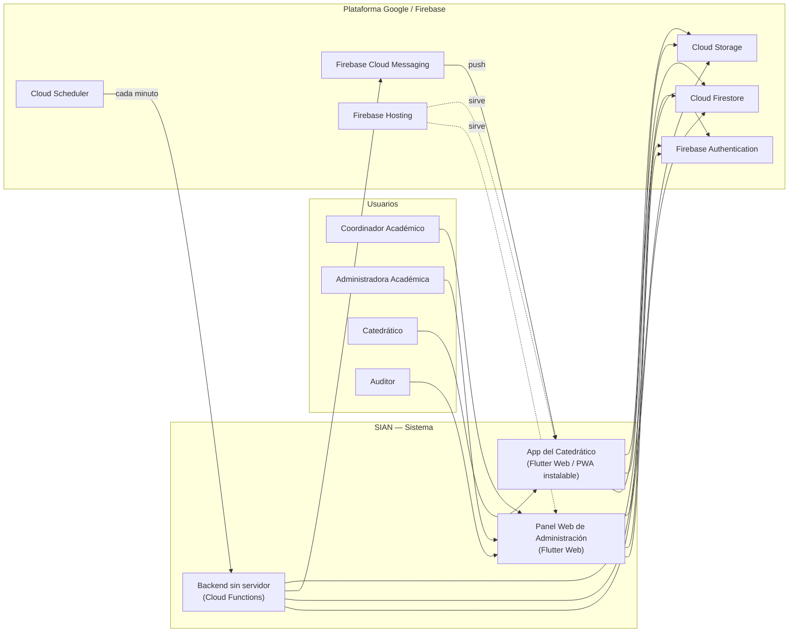
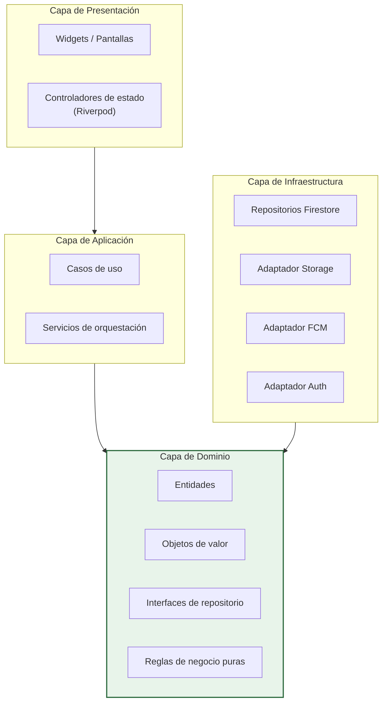
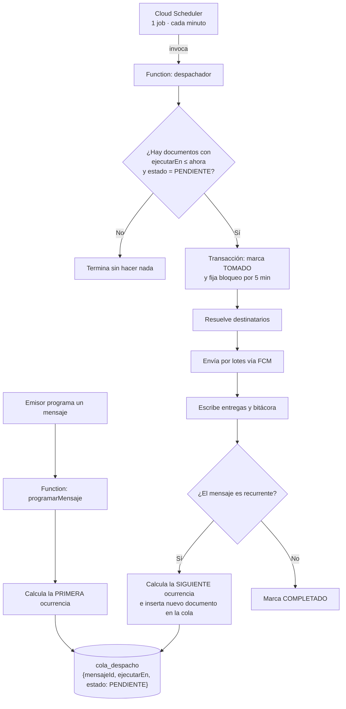
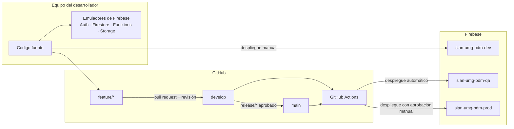

# 02 — Arquitectura y diseño

**Proyecto:** SIAN — Sistema Institucional de Avisos y Notificaciones
**Versión:** 1.0 · 2 de agosto de 2026

---

## 1. Vista de contexto



**Lectura del diagrama.** Los clientes leen datos directamente de Firestore, protegidos por
reglas de seguridad. Toda **escritura sensible** —enviar, programar, confirmar, auditar— pasa
obligatoriamente por Cloud Functions. Ningún cliente escribe jamás en la bitácora ni en la
cola de despacho.

---

## 2. Estilo arquitectónico

**Clean Architecture con cuatro capas** y regla de dependencia estricta: las flechas de
dependencia apuntan siempre hacia adentro, hacia el dominio.



### Por qué así

| Objetivo | Cómo lo consigue esta arquitectura |
|----------|-----------------------------------|
| Portabilidad (RNF-19) | El dominio no importa una sola línea de Firebase. Migrar a otro proveedor solo cambia la capa de infraestructura |
| Testabilidad (RNF-15) | Las reglas de recurrencia, validación y transición de estados se prueban sin red, sin emulador y sin nube |
| Valor didáctico | Cada capa es una lección visible: dónde vive una regla de negocio, dónde un detalle técnico |
| Reutilización | El mismo dominio sirve al panel web, a la app del catedrático y a las Cloud Functions |

> **Nota sobre el dominio compartido.** El dominio se escribe dos veces —en Dart para Flutter
> y en TypeScript para las Functions— porque son dos entornos de ejecución distintos. Para
> evitar que se desincronicen, las **reglas críticas de recurrencia y transición de estados
> viven únicamente en TypeScript, del lado del servidor**; el cliente solo las consume a
> través de las Functions. La duplicación queda documentada como deuda técnica DT-06.

---

## 3. Patrones de diseño aplicados

Cada patrón está justificado por un problema concreto del sistema. No se incluye ninguno por
adorno académico.

| Patrón | Dónde se aplica | Problema que resuelve |
|--------|-----------------|-----------------------|
| **Repository** | `IMensajeRepository`, `IUsuarioRepository`, `IBitacoraRepository` | Aísla el dominio de Firestore. Permite pruebas con repositorios en memoria |
| **Strategy** | `EstrategiaRecurrencia` con implementaciones `PorMinutos`, `PorHoras`, `PorDias`, `PorDiasDeSemana` | Cada patrón de repetición calcula la siguiente ocurrencia con su propio algoritmo, sin condicionales anidados |
| **Strategy** | `EstrategiaEntrega` con `EntregaTexto`, `EntregaVoz`, `EntregaImagen` | El armado de la carga útil de la notificación varía según el formato |
| **Factory Method** | `MensajeFactory.crear(tipo, formato)` | Construye la entidad correcta con sus invariantes ya validadas, sin exponer constructores parciales |
| **State** | `EstadoMensaje` y `EstadoEntrega` | Convierte las máquinas de estado del documento 01 en código explícito, impidiendo transiciones ilegales |
| **Observer** | Suscripciones en tiempo real de Firestore expuestas como `Stream` hacia los controladores Riverpod | El panel refleja el avance de un envío sin recargar ni sondear |
| **Command** | `ComandoAuditable` que envuelve toda operación que modifica estado | Garantiza que ninguna operación pueda ejecutarse sin dejar asiento en bitácora. Habilita reintentos idempotentes |
| **Facade** | `ServicioNotificacion` | Oculta tras una sola interfaz la coordinación de Firestore, Storage, FCM y bitácora |
| **Chain of Responsibility** | Cadena de validación previa al envío: permisos → contenido → adjuntos → destinatarios → programación | Cada validación es una clase pequeña, ordenada y reordenable |
| **Dependency Injection** | Contenedor Riverpod en el cliente, inyección por constructor en las Functions | Sustituir implementaciones reales por dobles de prueba sin tocar la lógica |
| **Unit of Work / Transacción** | Toma de ocurrencias en la cola de despacho | Impide el envío duplicado bajo ejecución concurrente (RF-PRG-12) |
| **Outbox** | Colección `cola_despacho` | Desacopla «decidir enviar» de «enviar realmente», y hace el envío reintentable y auditable |
| **Adapter** | `AdaptadorFCM`, `AdaptadorStorage` | El dominio habla su propio lenguaje; el adaptador traduce al SDK del proveedor |

### Antipatrones prohibidos en este proyecto

- Lógica de negocio dentro de widgets.
- Consultas a Firestore desde la capa de presentación.
- Autorización comprobada solo en la interfaz.
- Escritura directa del cliente en `bitacora`, `entregas` o `cola_despacho`.
- Un job de Cloud Scheduler por cada mensaje programado.

---

## 4. Diseño del planificador

Es la pieza más delicada del sistema y la que más restricciones tiene encima.

### 4.1 El problema

Cloud Scheduler regala **3 jobs por cuenta de facturación**, no por proyecto. Crear un job
por cada mensaje programado agotaría la cuota con el cuarto mensaje y empezaría a cobrar
0.10 USD por job cada 31 días.

### 4.2 La solución: patrón Outbox con un único job por ambiente



### 4.3 Garantías de diseño

| Garantía | Mecanismo |
|----------|-----------|
| Sin envíos duplicados (RF-PRG-12) | Transacción de Firestore que pasa `PENDIENTE → TOMADO` en una sola operación atómica. Quien pierde la carrera no encuentra nada que tomar |
| Recuperación tras caída (RF-PRG-13) | La cola es persistente. Al volver, el despachador encuentra las ocurrencias vencidas y las procesa si el retraso no excede la tolerancia configurada |
| Sin bucles infinitos (RF-PRG-14) | Contador de ocurrencias con tope, más fecha de fin obligatoria en toda recurrencia |
| Bloqueo liberable | El campo `bloqueoHasta` expira a los 5 minutos; una ejecución que muera a medio camino no deja la ocurrencia bloqueada para siempre |
| Precisión ≤ 60 s (RNF-04) | El job corre cada minuto; la desviación máxima es el intervalo del job |
| Costo cero | 1 job × 3 ambientes = 3 jobs = exactamente la cuota gratuita |

### 4.4 Alternativas evaluadas y descartadas

| Alternativa | Por qué se descartó |
|-------------|---------------------|
| Un job de Scheduler por mensaje | Rompe la cuota gratuita al cuarto mensaje |
| Cloud Tasks con retraso programado | Añade otro servicio y otra cuota que vigilar; el Outbox ya resuelve el caso |
| Trigger de Firestore con documento de vencimiento (TTL) | El borrado por TTL de Firestore no garantiza puntualidad; puede tardar hasta 24 horas |
| Cron externo gratuito, tipo cron-job.org | Dependencia de un tercero fuera del control institucional para funciones críticas como un simulacro |
| Job cada 5 minutos en lugar de cada minuto | Incumple RNF-04. El costo del job es el mismo, así que no aporta ahorro |

---

## 5. Modelo de despliegue y ambientes

Tres proyectos de Firebase **completamente separados**. Nunca se comparten datos entre
ambientes.

| Ambiente | Proyecto Firebase | Propósito | Quién accede |
|----------|-------------------|-----------|--------------|
| **Desarrollo** | `sian-umg-bdm-dev` | Trabajo diario. Se usan los emuladores locales siempre que sea posible | Equipo de desarrollo |
| **Pruebas de calidad** | `sian-umg-bdm-qa` | Validación funcional con el solicitante y con catedráticos voluntarios | Equipo + usuarios de prueba |
| **Producción** | `sian-umg-bdm-prod` | Operación real | Usuarios institucionales |

### Convención de nombres

`sian-umg-bdm-<ambiente>`, donde:

| Segmento | Significado |
|----------|-------------|
| `sian` | El sistema. Por sí solo es demasiado genérico para un identificador global de Google Cloud |
| `umg` | Universidad Mariano Gálvez |
| `bdm` | Sede Boca del Monte, que es el alcance de esta implantación |
| `<ambiente>` | `dev`, `qa` o `prod`, siempre presente |

**El sufijo de ambiente nunca se omite, ni siquiera en el primero que se crea.** Un
identificador de proyecto de Firebase es global, único e **inmutable**: si el proyecto de
desarrollo naciera sin sufijo, en la consola aparecería como si fuera el principal, y esa
ambigüedad solo se corrige creando otro proyecto y abandonando el anterior. Si mañana el
sistema se extiende a otra sede, la convención admite `sian-umg-<sede>-<ambiente>` sin tocar
nada de lo ya desplegado.



### Separación de configuración

- Ningún archivo de configuración de Firebase se versiona con valores reales.
- El repositorio incluye `.env.example` con las llaves vacías y su explicación.
- En local, la configuración vive en `.env.local`, incluido en `.gitignore`.
- En la integración continua, la configuración vive en los *secrets* de GitHub Actions.
- Los alias de Firebase (`firebase use dev|qa|prod`) determinan el destino del despliegue.

---

## 6. Estructura del repositorio

```
sian/
├── README.md
├── LICENSE
├── .gitignore
├── .env.example
├── firebase.json                  Hosting, Functions, Firestore, Storage, emuladores
├── .firebaserc                    Alias dev / qa / prod (sin IDs reales versionados)
├── firestore.rules
├── firestore.indexes.json
├── storage.rules
│
├── docs/                          Toda la documentación de ingeniería
│   ├── 01-levantamiento-requerimientos.md
│   ├── 02-arquitectura-y-diseno.md
│   ├── 03-diagrama-flujo.md
│   ├── 04-diagrama-secuencia.md
│   ├── 05-modelo-datos.md
│   ├── 06-guia-despliegue.md
│   ├── 07-deuda-tecnica.md
│   ├── 08-plan-iteraciones.md
│   └── adr/                       Registros de decisión de arquitectura
│
├── app/                           Aplicación Flutter (panel + app del catedrático)
│   ├── pubspec.yaml
│   ├── web/
│   │   ├── index.html
│   │   ├── manifest.json          Manifiesto PWA
│   │   └── firebase-messaging-sw.js   Service worker de notificaciones, separado
│   ├── lib/
│   │   ├── main.dart
│   │   ├── core/                  Errores, constantes, utilidades, inyección
│   │   ├── domain/                Entidades, objetos de valor, interfaces, reglas
│   │   ├── application/           Casos de uso
│   │   ├── infrastructure/        Implementaciones Firebase
│   │   └── presentation/
│   │       ├── shared/            Componentes comunes, tema, branding
│   │       ├── admin/             Panel de administración
│   │       └── docente/           Aplicación del catedrático
│   └── test/
│       ├── domain/
│       ├── application/
│       └── widget/
│
├── functions/                     Cloud Functions en TypeScript
│   ├── package.json
│   ├── tsconfig.json
│   ├── src/
│   │   ├── index.ts
│   │   ├── domain/                Reglas críticas: recurrencia y estados
│   │   ├── application/           Casos de uso del servidor
│   │   ├── infrastructure/        Adaptadores FCM, Firestore, Storage
│   │   └── triggers/
│   │       ├── programarMensaje.ts
│   │       ├── enviarInmediato.ts
│   │       ├── despachador.ts     Invocada por Cloud Scheduler
│   │       ├── confirmarLectura.ts
│   │       ├── onNuevoUsuario.ts
│   │       └── limpiarTokens.ts
│   └── test/
│
├── scripts/
│   ├── bootstrap.sh               Prepara el entorno local completo
│   ├── seed-dev.ts                Datos de prueba para desarrollo
│   └── check-secrets.sh
│
└── .github/
    └── workflows/
        ├── ci.yml                 Análisis estático, pruebas, cobertura
        └── deploy.yml             Despliegue a QA y a producción
```

---

## 7. Estrategia de ramas y control de cambios

**GitFlow simplificado**, adecuado para un equipo pequeño y didáctico:

| Rama | Propósito | Regla |
|------|-----------|-------|
| `main` | Refleja siempre lo que está en producción | Protegida. Solo entra por pull request desde `release/*` o `hotfix/*` |
| `develop` | Integración continua de lo que va a la siguiente versión | Protegida. Solo entra por pull request revisado |
| `feature/<id>-<descripcion>` | Una funcionalidad o un requisito | Nace de `develop` y regresa a `develop` |
| `release/<version>` | Estabilización antes de producción | Solo correcciones, nada de funcionalidad nueva |
| `hotfix/<id>` | Corrección urgente en producción | Nace de `main`, regresa a `main` y a `develop` |

**Convención de mensajes de commit** (Conventional Commits), con referencia obligatoria al
requisito:

```
feat(prg): calcular siguiente ocurrencia por dias de semana

Implementa EstrategiaRecurrencia.PorDiasDeSemana.
Refs: RF-PRG-07
```

**Definición de terminado.** Una funcionalidad no se considera terminada hasta que: pasa el
analizador estático sin advertencias, tiene pruebas unitarias de su lógica de dominio, está
documentada, cumple su criterio de aceptación y fue revisada por otra persona.

---

## 8. Estrategia de pruebas

| Nivel | Qué cubre | Herramienta | Dónde corre |
|-------|-----------|-------------|-------------|
| Unitarias | Reglas de recurrencia, transiciones de estado, validaciones, objetos de valor | `flutter test`, `jest` | Integración continua, en cada push |
| Reglas de seguridad | Que ningún rol pueda leer ni escribir fuera de su ámbito | `@firebase/rules-unit-testing` | Integración continua, sobre emulador |
| Integración | Despachador, idempotencia, envío por lotes | Emuladores de Firebase | Integración continua |
| Widget | Pantallas críticas: composición y confirmación | `flutter_test` | Integración continua |
| Extremo a extremo | Los 12 casos de uso completos | Manual guiada por lista de verificación en fase QA | Ambiente QA |
| Aceptación de usuario | Los criterios de aceptación del documento 01 | Sesión con el solicitante y catedráticos voluntarios | Ambiente QA |

**Prueba obligatoria antes de producción:** simulacro real de alerta urgente con al menos
10 dispositivos distintos, mezclando Android e iOS, midiendo tiempo hasta la primera
confirmación y hasta la última.

---

## 9. Seguridad

| Control | Implementación |
|---------|----------------|
| Autenticación | Firebase Authentication: Google OAuth y correo/contraseña |
| Lista blanca institucional | Colección `invitaciones` con los correos autorizados. Una Function verifica la pertenencia en el primer inicio de sesión y crea el perfil; si no está, rechaza y registra el intento |
| Autorización | *Custom claims* con el rol, sembrados por Function y verificados en reglas de Firestore, reglas de Storage y en cada Function |
| Cifrado en tránsito | TLS obligatorio, impuesto por Firebase Hosting |
| Cifrado en reposo | Cifrado por omisión de Google Cloud |
| Bitácora inmutable | Reglas que niegan `update` y `delete` sobre `bitacora` a todo cliente; solo el SDK de administración escribe |
| Protección de adjuntos | Reglas de Storage que permiten lectura únicamente al emisor y a los destinatarios del mensaje |
| Gestión de secretos | Nada en el repositorio. Secrets de GitHub Actions y variables de entorno locales |
| Control de gasto | Alerta de presupuesto en 1 USD, más límite máximo de instancias en las Functions |
| Auditoría de dependencias | `dependabot` habilitado, más `npm audit` en la integración continua |

---

## 10. Riesgos técnicos abiertos

| ID | Riesgo | Probabilidad | Impacto | Mitigación |
|----|--------|:---:|:---:|------------|
| R-01 | Las notificaciones web en iOS-PWA muestran comportamiento inestable reportado por la comunidad: el identificador de dispositivo cambia y las notificaciones dejan de llegar tras varios envíos | **Alta** | **Alto** | Refrescar y sincronizar el identificador en cada apertura de la aplicación. Prueba de resistencia obligatoria en el prototipo, con 20 envíos consecutivos sobre un iPhone real. Si falla, se activa el plan de contingencia del apartado 11 |
| R-02 | El catedrático no instala la PWA en su pantalla de inicio, y en iOS eso significa cero notificaciones | Alta | Alto | Instructivo guiado obligatorio en el primer acceso, con detección automática de si la aplicación corre instalada o en pestaña |
| R-03 | El service worker de Flutter Web entra en conflicto con el service worker de notificaciones | Media | Medio | Mantenerlos estrictamente separados: nunca fusionar la lógica de mensajería dentro del archivo generado por Flutter |
| R-04 | El usuario deniega el permiso de notificaciones y luego no sabe revertirlo | Media | Medio | Detectar el estado del permiso y mostrar instrucciones específicas por navegador |
| R-05 | El plan Blaze genera un cobro inesperado | Baja | Medio | Alerta de presupuesto en 1 USD, tope de instancias, y revisión semanal del consumo durante el primer mes |
| R-06 | El peso inicial de Flutter Web perjudica la carga en conexiones lentas | Media | Bajo | Compilación optimizada, precarga de recursos y medición contra RNF-03 |

---

## 11. Plan de contingencia si R-01 se materializa

Si la prueba de resistencia en iOS demuestra que las notificaciones web no son confiables
para alertas urgentes, se aplica esta secuencia, en orden:

1. **Redundancia por correo** para mensajes urgentes: una Function envía además un correo a
   los destinatarios. Costo cero con un proveedor de correo transaccional en su capa
   gratuita. Es la mitigación más barata y se recomienda implementarla desde el prototipo
   como respaldo permanente.
2. **Sonido dentro de la aplicación** cuando esté abierta, más insistencia visual sobre
   mensajes urgentes no confirmados.
3. **Compilar la misma base de código Flutter a Android nativo** y distribuir el APK
   firmado por descarga directa desde Firebase Hosting, sin tienda. Resuelve por completo
   Android; iOS seguiría en PWA.
4. **Último recurso:** replantear con el solicitante la restricción de no usar tiendas, solo
   para iOS.

Que estos cuatro pasos existan es la razón principal para elegir Flutter en lugar de una
aplicación web convencional: el paso 3 no requiere reescribir nada.

---

## 12. Registros de decisión de arquitectura

Toda decisión relevante se documenta en `docs/adr/` con el formato: contexto, opciones
consideradas, decisión, consecuencias y estado.

| ADR | Decisión | Estado |
|-----|----------|--------|
| ADR-001 | Firebase como plataforma de servicios en la nube | Aceptada |
| ADR-002 | Flutter como framework único para panel y aplicación | Aceptada |
| ADR-003 | Distribución exclusiva como PWA, sin tiendas de aplicaciones | Aceptada |
| ADR-004 | Patrón Outbox con un solo job de Cloud Scheduler por ambiente | Aceptada |
| ADR-005 | Clean Architecture con cuatro capas | Aceptada |
| ADR-006 | Nota de voz por grabación del emisor, sin texto a voz | Aceptada |
| ADR-007 | Tres proyectos de Firebase separados por ambiente | Aceptada |
| ADR-008 | Lista blanca de correos institucionales en lugar de funciones de bloqueo de Identity Platform | Aceptada |
