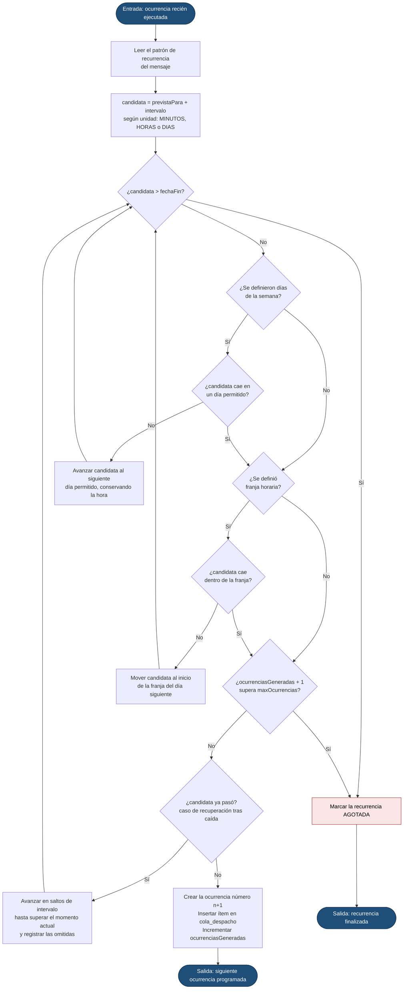
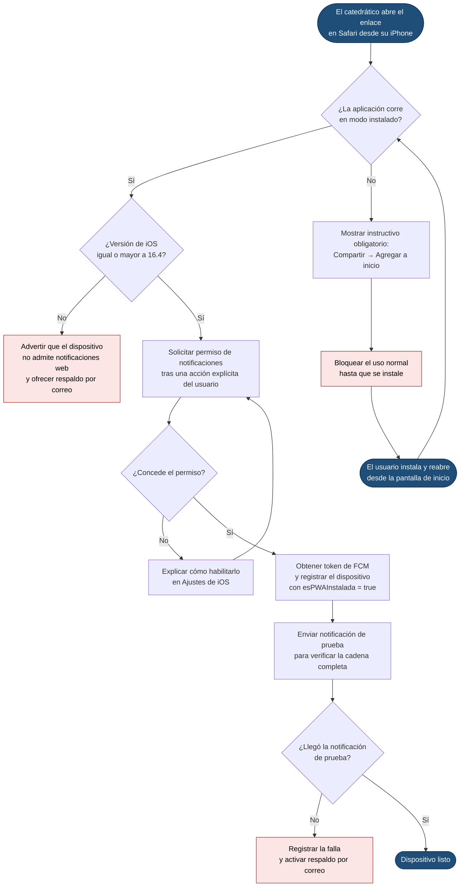

# 03 — Diagrama de flujo del sistema

**Versión:** 1.0 · 2 de agosto de 2026
Los diagramas están en Mermaid y GitHub los renderiza directamente en la vista del archivo.

---

## 1. Flujo general del sistema, de extremo a extremo

```mermaid
flowchart TD
    START(["Inicio"]) --> LOGIN{"¿Sesión activa?"}
    LOGIN -->|No| AUTH["Pantalla de autenticación"]
    AUTH --> METODO{"Método de acceso"}
    METODO -->|Google| GOOGLE["OAuth 2.0 con Google"]
    METODO -->|Correo| CORREO["Correo y contraseña"]
    GOOGLE --> VALIDA
    CORREO --> VALIDA{"¿El correo está en la<br/>lista blanca institucional?"}
    VALIDA -->|No| RECHAZO["Rechazar acceso<br/>Registrar SESION_RECHAZADA"]
    RECHAZO --> AUTH
    VALIDA -->|Sí| PERFIL["Crear o cargar perfil<br/>Asignar rol en el token"]
    PERFIL --> PERMISO{"¿Permiso de notificaciones<br/>concedido?"}
    PERMISO -->|No| SOLICITAR["Solicitar permiso<br/>y guiar instalación de la PWA"]
    SOLICITAR --> TOKEN
    PERMISO -->|Sí| TOKEN["Registrar dispositivo<br/>y token de notificación"]
    TOKEN --> ROL{"¿Qué rol tiene?"}
    LOGIN -->|Sí| ROL

    ROL -->|Coordinador o Administradora| PANEL["Panel de administración"]
    ROL -->|Catedrático| APP["Aplicación del catedrático"]
    ROL -->|Auditor| AUDIT["Vista de bitácora"]

    %% ---------- Rama del emisor ----------
    PANEL --> ACCION{"¿Qué desea hacer?"}
    ACCION -->|Emitir mensaje| COMPONER["Componer mensaje"]
    ACCION -->|Ver trazabilidad| TRAZA["Consultar entregas<br/>y confirmaciones"]
    ACCION -->|Administrar| ADMIN["Usuarios, grupos<br/>y configuración"]
    ACCION -->|Gestionar programados| GESTION["Suspender, reanudar<br/>o cancelar"]

    COMPONER --> TIPO["Clasificar:<br/>Informativo o Urgente"]
    TIPO --> CONTENIDO["Redactar texto"]
    CONTENIDO --> ADJ{"¿Adjunta multimedia?"}
    ADJ -->|Voz| VOZ["Grabar nota de voz<br/>máx. 60 s / 2 MB"]
    ADJ -->|Imagen| IMG["Seleccionar imagen<br/>máx. 5 MB"]
    ADJ -->|No| DEST
    VOZ --> SUBIR["Subir a Cloud Storage"]
    IMG --> SUBIR
    SUBIR --> DEST["Seleccionar destinatarios:<br/>todos, grupos o individual"]
    DEST --> CONF{"¿Requiere confirmación<br/>de lectura?"}
    CONF -->|Sí| MARCAR["Marcar requiereConfirmacion"]
    CONF -->|No| CUANDO
    MARCAR --> CUANDO{"¿Cuándo se envía?"}

    CUANDO -->|Ahora| VALURG
    CUANDO -->|Fecha y hora específicas| PROG["Definir fecha y hora<br/>en zona horaria institucional"]
    CUANDO -->|Recurrente| RECUR["Definir rango de días,<br/>intervalo y días de la semana"]

    PROG --> VALFECHA{"¿La fecha es futura?"}
    VALFECHA -->|No| ERRFECHA["Error: fecha inválida"]
    ERRFECHA --> CUANDO
    VALFECHA -->|Sí| VALURG

    RECUR --> PREVIEW["Mostrar las próximas<br/>10 ocurrencias calculadas"]
    PREVIEW --> OKPREV{"¿El emisor aprueba<br/>el patrón?"}
    OKPREV -->|No| RECUR
    OKPREV -->|Sí| VALURG

    VALURG{"¿Es alerta urgente?"}
    VALURG -->|Sí| DOBLE["Doble confirmación obligatoria<br/>mostrando el conteo de destinatarios"]
    VALURG -->|No| CADENA
    DOBLE --> OKDOBLE{"¿Confirma?"}
    OKDOBLE -->|No| BORRADOR["Guardar como borrador"]
    OKDOBLE -->|Sí| CADENA["Cadena de validación:<br/>permisos → contenido →<br/>adjuntos → destinatarios → programación"]

    CADENA --> VALOK{"¿Todas las<br/>validaciones pasan?"}
    VALOK -->|No| ERRVAL["Mostrar errores<br/>y volver a composición"]
    ERRVAL --> COMPONER
    VALOK -->|Sí| GUARDAR["Guardar mensaje<br/>Registrar MENSAJE_CREADO"]
    GUARDAR --> ENCOLAR["Calcular primera ocurrencia<br/>e insertarla en cola_despacho"]
    ENCOLAR --> ESPERA(["Mensaje encolado"])

    %% ---------- Rama del planificador ----------
    CRON(["Cloud Scheduler<br/>cada 60 segundos"]) --> DESPACHADOR["Function: despachador"]
    DESPACHADOR --> CONSULTA["Consultar cola_despacho:<br/>estado = PENDIENTE<br/>y ejecutarEn ≤ ahora"]
    CONSULTA --> HAY{"¿Hay ocurrencias<br/>vencidas?"}
    HAY -->|No| FIN1(["Terminar sin acción"])
    HAY -->|Sí| TX["Transacción atómica:<br/>PENDIENTE → TOMADO<br/>bloqueo por 5 minutos"]
    TX --> GANO{"¿Ganó el bloqueo?"}
    GANO -->|No| FIN1
    GANO -->|Sí| RETRASO{"¿El retraso excede<br/>la tolerancia configurada?"}
    RETRASO -->|Sí| OMITIR["Marcar OMITIDA<br/>Registrar OCURRENCIA_OMITIDA"]
    OMITIR --> SIGUIENTE
    RETRASO -->|No| RESOLVER["Resolver destinatarios:<br/>expandir grupos y quitar<br/>usuarios desactivados"]

    ESPERA -.->|"su hora llega"| CONSULTA

    RESOLVER --> TOKENS["Recuperar tokens activos<br/>de cada destinatario"]
    TOKENS --> LOTES["Dividir en lotes de 500"]
    LOTES --> ENVIAR["Enviar a FCM<br/>prioridad alta si es urgente"]
    ENVIAR --> RESULTADO{"Resultado por destinatario"}
    RESULTADO -->|Éxito| REGOK["Registrar entrega<br/>estado = ENTREGADO"]
    RESULTADO -->|Fallo| REINTENTO{"¿Quedan reintentos?<br/>máximo 3"}
    REINTENTO -->|Sí| ESPERAR["Esperar con retroceso<br/>exponencial"]
    ESPERAR --> ENVIAR
    REINTENTO -->|No| REGFAIL["Registrar entrega<br/>estado = DESCARTADO<br/>Bitácora: ENTREGA_FALLIDA"]
    REGOK --> ACTUALIZAR
    REGFAIL --> ACTUALIZAR["Actualizar contadores<br/>de la ocurrencia y del mensaje"]
    ACTUALIZAR --> BITENV["Registrar ENVIO_COMPLETADO"]
    BITENV --> SIGUIENTE{"¿El mensaje<br/>es recurrente?"}
    SIGUIENTE -->|No| COMPLETAR["Marcar ítem COMPLETADO"]
    SIGUIENTE -->|Sí| LIMITE{"¿Se alcanzó fecha fin<br/>o el máximo de ocurrencias?"}
    LIMITE -->|Sí| AGOTAR["Marcar mensaje AGOTADO<br/>y avisar al creador"]
    LIMITE -->|No| CALCULAR["Calcular siguiente ocurrencia<br/>según la estrategia de recurrencia"]
    CALCULAR --> NUEVOITEM["Insertar nuevo ítem<br/>en cola_despacho"]
    NUEVOITEM --> COMPLETAR
    AGOTAR --> COMPLETAR
    COMPLETAR --> FIN2(["Fin del ciclo de despacho"])

    %% ---------- Rama del catedrático ----------
    ENVIAR -.->|"push"| RECIBE["El dispositivo recibe<br/>la notificación"]
    RECIBE --> ESTADO{"¿La aplicación está<br/>en primer plano?"}
    ESTADO -->|Sí| ENAPP["Mostrar aviso dentro<br/>de la aplicación con sonido"]
    ESTADO -->|No| SW["El service worker muestra<br/>la notificación del sistema"]
    ENAPP --> ALERTA
    SW --> ALERTA["Alerta al usuario:<br/>visual, sonora y vibración<br/>según lo permita la plataforma"]
    ALERTA --> ABRE{"¿El catedrático<br/>la abre?"}
    ABRE -->|No| PENDIENTE["Queda pendiente<br/>en el historial"]
    PENDIENTE --> APP
    ABRE -->|Sí| DESPLIEGA["Despliega la fila<br/>en la bandeja"]
    DESPLIEGA --> DETALLE["Mostrar detalle: texto y<br/>adjuntos EN EL ORDEN<br/>en que se adjuntaron"]
    DETALLE --> MARCARABIERTO["Registrar MENSAJE_ABIERTO<br/>estado = ABIERTO"]
    MARCARABIERTO --> REQCONF{"¿El mensaje requiere<br/>confirmación?"}
    REQCONF -->|No| FIN3(["Fin"])
    REQCONF -->|Sí| BOTON["Mostrar el control<br/>Confirmar lectura"]
    BOTON --> PULSA{"¿Lo pulsa?"}
    PULSA -->|No| INSISTIR["Insistir visualmente<br/>si el mensaje es urgente"]
    INSISTIR --> APP
    PULSA -->|Sí| FNCONF["Function: confirmarLectura"]
    FNCONF --> YACONF{"¿Ya estaba<br/>confirmado?"}
    YACONF -->|Sí| IGNORAR["Ignorar duplicado"]
    YACONF -->|No| GRABAR["Grabar uid, fecha, hora<br/>y dispositivo<br/>Registrar LECTURA_CONFIRMADA"]
    GRABAR --> ACTCONT["Actualizar contador<br/>de confirmaciones del mensaje"]
    ACTCONT --> VISIBLE["El emisor lo ve en tiempo real<br/>en la vista de trazabilidad"]
    VISIBLE --> TRAZA
    IGNORAR --> FIN3

    %% ---------- Estilos ----------
    classDef inicio fill:#1f4e79,stroke:#0d2b45,color:#ffffff
    classDef decision fill:#fff2cc,stroke:#bf8f00,color:#000000
    classDef proceso fill:#e2efda,stroke:#375623,color:#000000
    classDef error fill:#fbe5e5,stroke:#a62828,color:#000000
    classDef sistema fill:#deebf7,stroke:#1f4e79,color:#000000

    class START,FIN1,FIN2,FIN3,CRON,ESPERA inicio
    class RECHAZO,ERRFECHA,ERRVAL,REGFAIL,OMITIR,AGOTAR error
    class DESPACHADOR,CONSULTA,TX,RESOLVER,TOKENS,LOTES,ENVIAR,CALCULAR,NUEVOITEM sistema
```

---

> **Se marca como abierto al DESPLEGAR, no al dibujar la lista.** Antes bastaba
> con que la bandeja se pintara para que todo constara como abierto: un dato de
> seguimiento convertido en una casilla que se marca sola. Ahora se registra
> cuando el texto aparece de verdad delante de la persona.
>
> Y **abrir sigue sin ser confirmar** (RF-CNF-02): abrir dice que lo miró;
> confirmar, que declaró haberlo leído. Mezclarlos convertiría una evidencia en
> una suposición.
>
> La única excepción es una urgente sin confirmar: nace desplegada, así que se
> marca de entrada — su contenido sí está delante desde el primer momento.

## 2. Subflujo: cálculo de la siguiente ocurrencia recurrente

Es la lógica que más defectos suele producir en este tipo de sistemas, por eso se aísla y se
detalla.

> **Nota de conversión horaria.** Todos los cálculos se hacen en la zona horaria institucional
> y se convierten a UTC solo al escribir en la base de datos (RN-05). Hacerlo al revés
> produce desfases de una hora en los cambios de horario de verano en zonas que lo aplican.

---

## 3. Subflujo: primer acceso desde un dispositivo iOS

Este subflujo existe por una restricción real de la plataforma (RES-05) y es el punto de
mayor riesgo de adopción del proyecto (R-02).

> El **envío de prueba automático** al terminar el registro no es un adorno: es la única
> forma de detectar de inmediato el riesgo R-01, en lugar de descubrirlo el día del simulacro.
