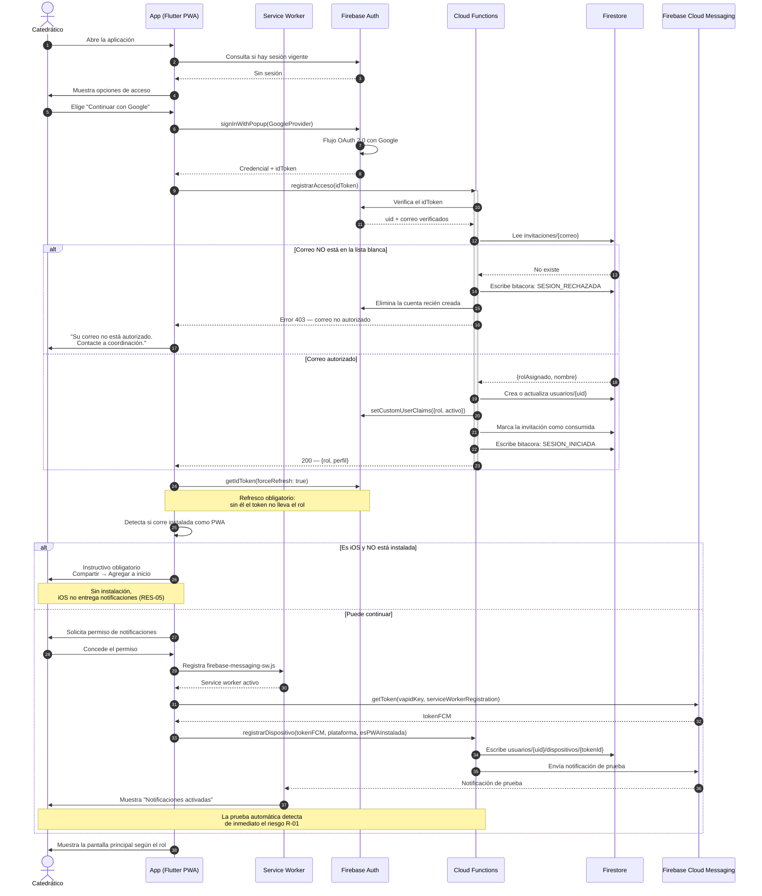
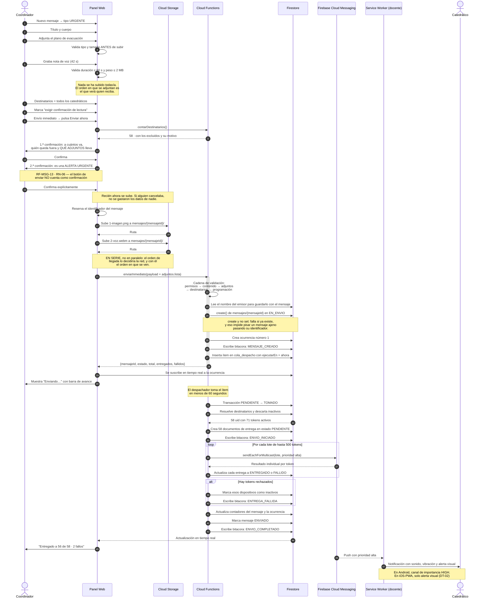
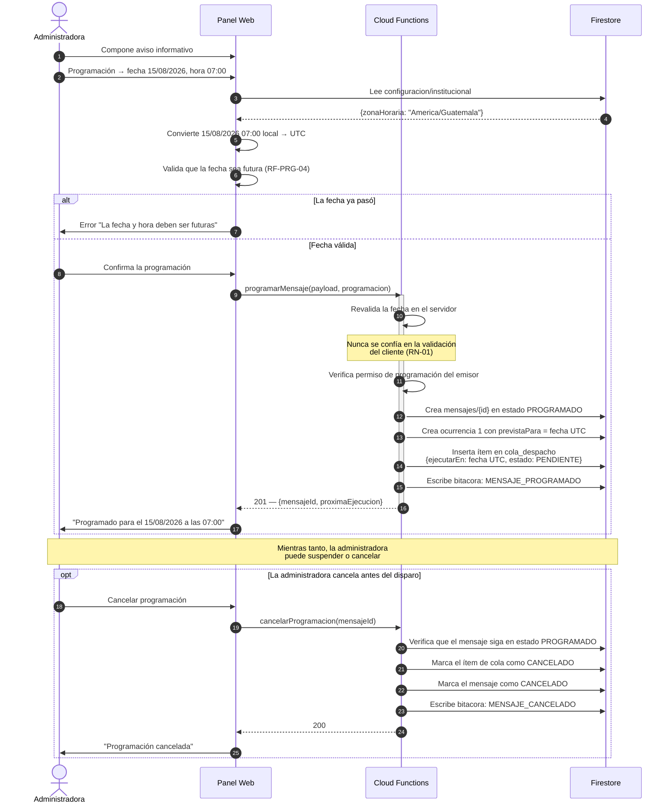
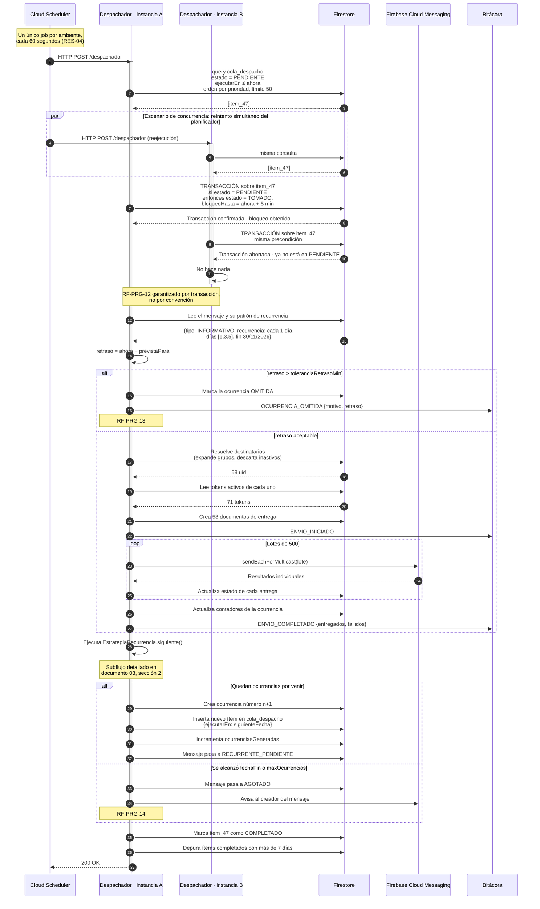
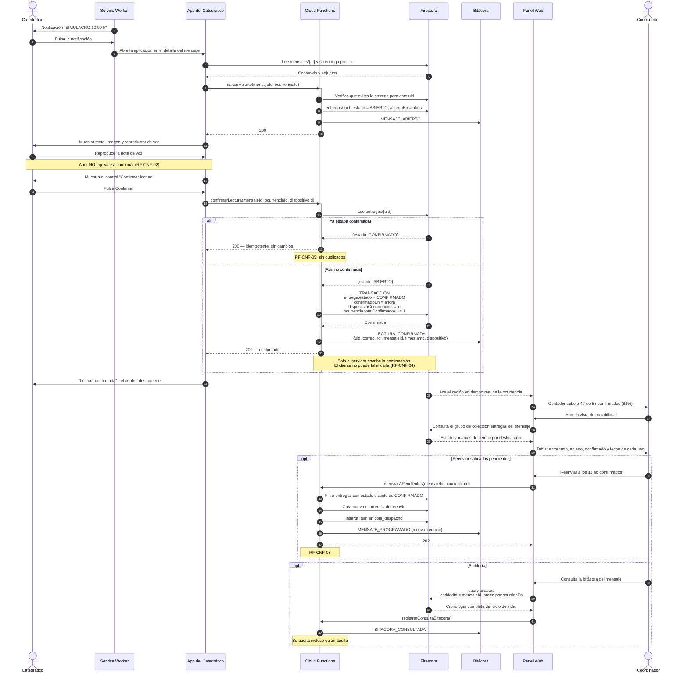

# 04 — Diagramas de secuencia

**Versión:** 1.0 · 2 de agosto de 2026

Cinco secuencias cubren la totalidad del comportamiento del sistema:

1. Autenticación y registro de dispositivo
2. Envío inmediato de alerta urgente con voz e imagen
3. Programación de mensaje para fecha y hora específicas
4. Despacho automático y generación de la siguiente ocurrencia recurrente
5. Confirmación de lectura y trazabilidad

---

## 1. Autenticación y registro de dispositivo

---

## 2. Envío inmediato de alerta urgente con voz e imagen

---

## 3. Programación de un mensaje para fecha y hora específicas

---

## 4. Despacho automático y generación de la siguiente ocurrencia recurrente

Es la secuencia crítica del sistema. Muestra cómo se garantiza que no haya envíos duplicados
(RF-PRG-12) usando un solo job de Cloud Scheduler (RES-04).

---

## 5. Confirmación de lectura y trazabilidad

---

## 6. Correspondencia entre secuencias y requisitos

| Secuencia | Requisitos que demuestra |
|-----------|--------------------------|
| 1 · Autenticación | RF-AUT-01, 02, 03, 04 · RF-USR-09 · RES-05 · R-01 |
| 2 · Envío inmediato urgente | RF-MSG-01..13 · RF-PRG-01 · RF-ENT-01..06, 10, 11, 14 |
| 3 · Programación | RF-PRG-02, 03, 04, 11 · RN-01, RN-05 |
| 4 · Despacho y recurrencia | RF-PRG-05..14 · RF-ENT-14 · RNF-04, RNF-06 · RES-04 |
| 5 · Confirmación y trazabilidad | RF-CNF-01..08 · RF-BIT-01, 02, 07, 08 · RNF-17 |
