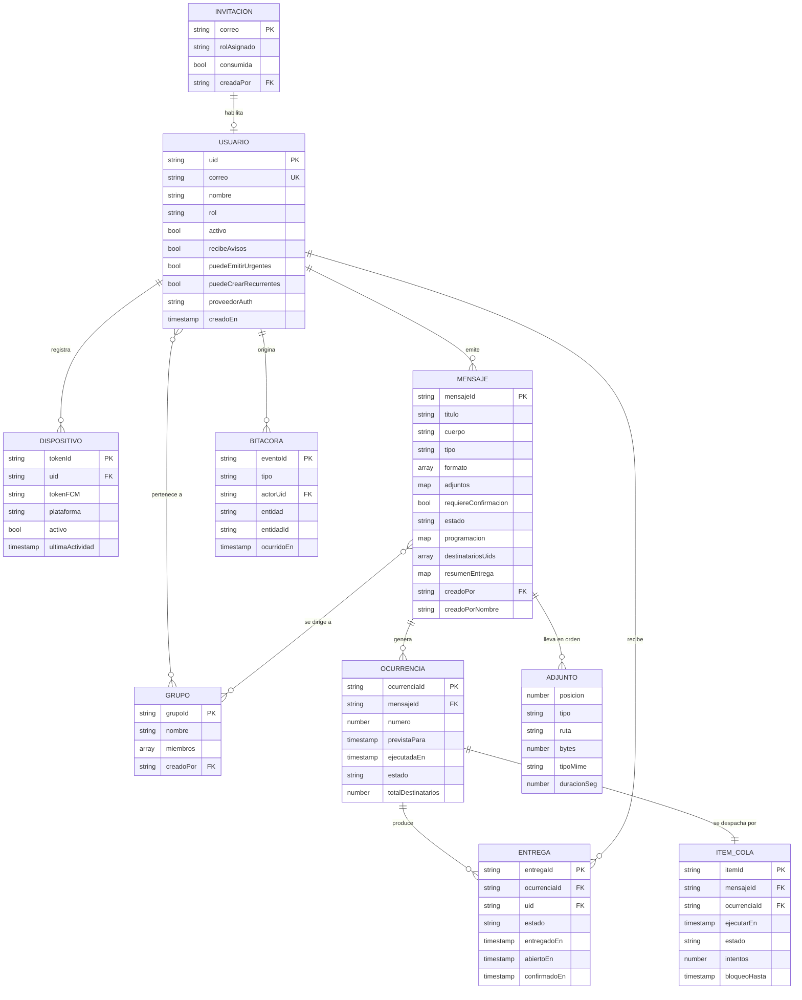

# 05 — Modelo de datos

**Base de datos:** Cloud Firestore (modo nativo)
**Versión:** 1.0 · 2 de agosto de 2026

---

## 1. Modelo entidad-relación




> **`ADJUNTO` no es una colección.** Se dibuja como entidad para que se vea su
> forma, pero vive **dentro** del mensaje, en `adjuntos.lista`: un arreglo
> ordenado con hasta 3 imágenes y 2 notas de voz. El orden es el que eligió
> quien redactó y es el que ve quien recibe, así que **la posición es parte del
> dato** y no un detalle de presentación. Guardarlo como dos listas separadas
> —audios por un lado, imágenes por otro— obligaría a reconstruir ese orden al
> mostrarlo, y no hay forma de reconstruir lo que no se guardó.
>
> Los mensajes anteriores a agosto de 2026 llevan la forma antigua,
> `{audio, imagen}`, con uno de cada como máximo. Se siguen leyendo: RN-03 dice
> que un mensaje enviado no se reescribe, así que dejar de entenderla borraría
> los adjuntos de todo lo entregado hasta entonces.
>
> **`creadoPorNombre` está repetido a propósito.** El nombre de quien envía se
> guarda dentro del mensaje porque el catedrático **no tiene permiso para leer
> `usuarios`**; sin esa copia vería un identificador aleatorio donde debería
> decir quién le avisa. Queda congelado: si esa persona cambia de nombre, el
> aviso sigue diciendo quién lo firmó cuando lo firmó (RF-BIT-02).

---

## 2. Colecciones de Firestore

### 2.1 `usuarios/{uid}`

El identificador del documento es el UID de Firebase Authentication.

| Campo | Tipo | Obligatorio | Descripción |
|-------|------|:---:|-------------|
| `correo` | string | Sí | Correo institucional, en minúsculas. Único |
| `nombre` | string | Sí | Nombre completo |
| `rol` | string | Sí | `COORDINADOR` · `ADMINISTRADORA` · `CATEDRATICO` · `AUDITOR` |
| `activo` | boolean | Sí | `false` desactiva sin borrar (RN-10) |
| `proveedorAuth` | string | Sí | `google.com` o `password` |
| `unidadAcademica` | string | No | Facultad o escuela |
| `puedeEmitirUrgentes` | boolean | Sí | Autorización fina para el rol Administradora |
| `puedeCrearRecurrentes` | boolean | Sí | Autorización fina para el rol Administradora |
| `zonaHoraria` | string | No | Heredada de la configuración institucional si está vacía |
| `creadoEn` | timestamp | Sí | |
| `actualizadoEn` | timestamp | Sí | |
| `ultimoAcceso` | timestamp | No | |

### 2.2 `usuarios/{uid}/dispositivos/{tokenId}`

| Campo | Tipo | Descripción |
|-------|------|-------------|
| `tokenFCM` | string | Identificador de registro de Firebase Cloud Messaging |
| `plataforma` | string | `WEB_ANDROID` · `WEB_IOS` · `WEB_ESCRITORIO` |
| `esPWAInstalada` | boolean | Crítico en iOS: sin instalación no hay notificaciones (RES-05) |
| `navegador` | string | Nombre y versión |
| `permisoNotificacion` | string | `concedido` · `denegado` · `pendiente` |
| `activo` | boolean | Se pone en `false` cuando FCM rechaza el token |
| `registradoEn` | timestamp | |
| `ultimaActividad` | timestamp | Base para la depuración de tokens inactivos (RF-USR-10) |

> **Decisión.** Los dispositivos son subcolección y no un arreglo dentro del usuario, porque
> un arreglo obligaría a reescribir el documento completo en cada refresco de token y
> generaría contención de escritura.

### 2.3 `grupos/{grupoId}`

| Campo | Tipo | Descripción |
|-------|------|-------------|
| `nombre` | string | |
| `descripcion` | string | |
| `miembros` | array de string | UIDs. Se limita a 200 elementos; por encima se migra a subcolección |
| `totalMiembros` | number | Desnormalizado, para mostrar el conteo sin leer el arreglo |
| `creadoPor` | string | UID |
| `creadoEn` | timestamp | |
| `activo` | boolean | |

### 2.4 `mensajes/{mensajeId}`

| Campo | Tipo | Descripción |
|-------|------|-------------|
| `titulo` | string | Máximo 80 caracteres (RF-MSG-06) |
| `cuerpo` | string | Máximo 500 caracteres |
| `tipo` | string | `INFORMATIVO` · `URGENTE` |
| `formato` | array de string | Combinación de `TEXTO`, `VOZ`, `IMAGEN` |
| `adjuntos` | map | `{ audio: {ruta, bytes, duracionSeg}, imagen: {ruta, bytes, ancho, alto} }` |
| `requiereConfirmacion` | boolean | RF-MSG-12 |
| `estado` | string | Según la máquina de estados del documento 01, sección 9 |
| `destinatarios` | map | `{ modo: 'TODOS'\|'GRUPOS'\|'INDIVIDUAL', gruposIds: [], usuariosIds: [] }` |
| `destinatariosUids` | array de string | Lista plana de UID ya resueltos. **Existe únicamente para que las reglas de seguridad puedan decidir si el lector es destinatario**, cosa que no pueden hacer consultando otra colección. Lo escribe la Function al despachar |
| `programacion` | map | Ver estructura en 2.5 |
| `totalDestinatarios` | number | Resuelto en el momento del despacho |
| `resumenEntrega` | map | `{ entregados, fallidos, abiertos, confirmados }`, actualizado por Function |
| `creadoPor` | string | UID del emisor |
| `creadoEn` | timestamp | |
| `enviadoEn` | timestamp | Nulo mientras no se despache |
| `referenciaCorreccion` | string | ID del mensaje que corrige, si aplica (RN-03) |

### 2.5 Estructura del campo `programacion`

```jsonc
{
  "modo": "INMEDIATO",          // INMEDIATO | UNICO | RECURRENTE
  "zonaHoraria": "America/Guatemala",

  // solo cuando modo = UNICO
  "ejecutarEn": "2026-08-15T14:00:00Z",   // siempre UTC (RN-05)

  // solo cuando modo = RECURRENTE
  "recurrencia": {
    "fechaInicio": "2026-08-05T00:00:00Z",
    "fechaFin":    "2026-11-30T23:59:59Z",   // obligatoria (RF-PRG-14)
    "unidadIntervalo": "DIAS",               // MINUTOS | HORAS | DIAS
    "valorIntervalo": 1,
    "diasSemana": [1, 3, 5],                 // 1=lunes … 7=domingo; vacío = todos
    "horaDelDia": "07:30",                   // hora local institucional
    "franjaHoraria": { "desde": "07:00", "hasta": "19:00" },  // opcional
    "maxOcurrencias": 500,
    "ocurrenciasGeneradas": 12,
    "suspendida": false
  }
}
```

### 2.6 `mensajes/{mensajeId}/ocurrencias/{ocurrenciaId}`

Un mensaje inmediato o único genera exactamente una ocurrencia. Un recurrente genera una por
cada disparo (RN-07).

| Campo | Tipo | Descripción |
|-------|------|-------------|
| `numero` | number | Secuencial, empezando en 1 |
| `previstaPara` | timestamp | Hora teórica de disparo |
| `ejecutadaEn` | timestamp | Hora real de disparo |
| `desviacionSeg` | number | Diferencia entre ambas. Evidencia de RNF-04 |
| `estado` | string | `PENDIENTE` · `EN_ENVIO` · `COMPLETADA` · `COMPLETADA_CON_FALLOS` · `OMITIDA` · `CANCELADA` |
| `totalDestinatarios` | number | |
| `totalEntregados` | number | |
| `totalFallidos` | number | |
| `motivoOmision` | string | Por ejemplo, retraso mayor a la tolerancia (RF-PRG-13) |

### 2.7 `mensajes/{mensajeId}/ocurrencias/{ocurrenciaId}/entregas/{uid}`

El identificador del documento **es el UID del destinatario**. Esta decisión hace imposible
por construcción que exista una entrega duplicada para el mismo destinatario y facilita
RF-CNF-05.

| Campo | Tipo | Descripción |
|-------|------|-------------|
| `uid` | string | **Duplica el identificador del documento a propósito.** Las consultas por grupo de colección no pueden filtrar por identificador de documento, y el historial del catedrático (RF-ENT-12) es exactamente esa consulta |
| `mensajeId` | string | Desnormalizado, para poder mostrar el historial sin una lectura adicional por cada mensaje |
| `estado` | string | Según la máquina de estados del documento 01, sección 10 |
| `enviadoAFcmEn` | timestamp | |
| `entregadoEn` | timestamp | |
| `abiertoEn` | timestamp | Distinto de confirmado (RF-CNF-02) |
| `confirmadoEn` | timestamp | Solo lo escribe la Function de confirmación |
| `dispositivoConfirmacion` | string | RF-CNF-03 |
| `intentos` | number | |
| `ultimoError` | string | Código de error devuelto por FCM |

### 2.8 `cola_despacho/{itemId}`

Colección de nivel raíz. **Ningún cliente puede leerla ni escribirla.**

| Campo | Tipo | Descripción |
|-------|------|-------------|
| `mensajeId` | string | |
| `ocurrenciaId` | string | |
| `ejecutarEn` | timestamp | Campo sobre el que consulta el despachador |
| `estado` | string | `PENDIENTE` · `TOMADO` · `COMPLETADO` · `FALLIDO` |
| `intentos` | number | |
| `bloqueoHasta` | timestamp | Vence a los 5 minutos, para liberar ejecuciones muertas |
| `prioridad` | number | Las urgentes se procesan primero dentro del mismo lote |
| `creadoEn` | timestamp | |

### 2.9 `bitacora/{eventoId}`

Colección de nivel raíz, **inmutable** (RF-BIT-03).

| Campo | Tipo | Descripción |
|-------|------|-------------|
| `tipo` | string | Ver catálogo en la sección 3 |
| `actorUid` | string | UID, o `SISTEMA` cuando el actor es el planificador |
| `actorCorreo` | string | Desnormalizado: la bitácora debe leerse sin depender de que el usuario siga existiendo |
| `actorRol` | string | Rol vigente al momento del evento |
| `entidad` | string | `MENSAJE` · `USUARIO` · `GRUPO` · `ENTREGA` · `SESION` · `CONFIGURACION` |
| `entidadId` | string | |
| `resumen` | string | Descripción legible del evento |
| `datos` | map | Detalle estructurado, sin datos personales innecesarios |
| `ocurridoEn` | timestamp | UTC |
| `origen` | string | `PANEL_WEB` · `APP_DOCENTE` · `PLANIFICADOR` |
| `hashPrevio` | string | Encadenamiento opcional contra manipulación (RF-BIT-10) |

### 2.10 `invitaciones/{correoNormalizado}`

Lista blanca institucional. El identificador del documento es el correo en minúsculas, lo que
garantiza unicidad sin necesidad de consulta.

| Campo | Tipo | Descripción |
|-------|------|-------------|
| `rolAsignado` | string | Rol que se otorgará al consumirse |
| `nombre` | string | Nombre esperado, para prellenar el perfil |
| `consumida` | boolean | La invitación ya se usó. **Una carga masiva nunca lo reescribe** |
| `consumidaPor` | string | UID resultante |
| `consumidaEn` | timestamp | Cuándo se usó |
| `creadaPor` | string | UID del coordinador |
| `creadaEn` | timestamp | |

**Volver a cargar un correo que ya está en la lista.** El identificador es el correo, así que
una recarga no puede duplicar: cae sobre el mismo documento. Lo que decide qué pasa es si esa
invitación ya se usó.

| Estado previo | Qué ocurre |
|---|---|
| No existe | Se crea |
| Existe y `consumida = false` | Se actualizan `rolAsignado` y `nombre`. Corregir una lista antes de que la gente entre es legítimo |
| Existe y `consumida = true` | **No se toca nada**, y quien cargó recibe la lista de esos correos |

A quien ya entró no se le toca la invitación porque su rol de verdad no vive aquí: vive en su
perfil (`usuarios/{uid}`) y en sus custom claims. Cambiarlo en la invitación no se lo cambia a
la persona; solo deja a los dos sitios diciendo cosas distintas. Se cambia desde la pantalla
de usuarios, que sí mueve las dos (RF-USR-02).

> **Esto se escribió después de romperlo.** La carga masiva escribía `consumida: false` sobre
> todo lo que llegaba, con `merge: true` y un comentario que decía servir para lo contrario.
> `merge` respeta los campos que **no** se mandan, y `consumida` iba en el objeto. Una persona
> que ya había entrado quedó con `consumida: false` junto a su `consumidaPor` y su
> `consumidaEn` intactos: un documento contradiciéndose. Y con eso desarmado deja de funcionar
> la comprobación de `decidirActivacion` que rechaza a quien intenta usar una invitación que
> otro ya consumió. La regla vive ahora en `decidirCarga`, en el dominio, con sus pruebas.

### 2.11 `configuracion/institucional`

Documento único con los parámetros globales.

| Campo | Tipo | Valor por omisión |
|-------|------|-------------------|
| `zonaHoraria` | string | `America/Guatemala` |
| `toleranciaRetrasoMin` | number | `30` |
| `maxOcurrenciasPorMensaje` | number | `500` |
| `tamanoLoteFCM` | number | `500` |
| `maxReintentosEntrega` | number | `3` |
| `retencionBitacoraMeses` | number | `24` |
| `nombreInstitucion` | string | Marcador de posición hasta recibir el branding |
| `urlLogo` | string | Marcador de posición |

---

## 3. Catálogo de eventos de bitácora

| Tipo de evento | Origen | Cuándo se registra |
|----------------|--------|--------------------|
| `SESION_INICIADA` | Cliente | Inicio de sesión exitoso |
| `SESION_RECHAZADA` | Function | Correo fuera de la lista blanca (RF-AUT-03) |
| `SESION_CERRADA` | Cliente | Cierre explícito |
| `USUARIO_CREADO` | Function | Primer acceso con invitación válida |
| `USUARIO_ROL_CAMBIADO` | Function | Cambio de rol |
| `USUARIO_DESACTIVADO` | Function | Desactivación |
| `GRUPO_CREADO` / `GRUPO_MODIFICADO` | Function | |
| `MENSAJE_CREADO` | Function | Se guarda el borrador |
| `MENSAJE_PROGRAMADO` | Function | Se define la programación |
| `MENSAJE_SUSPENDIDO` / `MENSAJE_REANUDADO` | Function | RF-PRG-10 |
| `MENSAJE_CANCELADO` | Function | RF-PRG-11 |
| `OCURRENCIA_DISPARADA` | Planificador | El despachador toma la ocurrencia |
| `OCURRENCIA_OMITIDA` | Planificador | Retraso mayor a la tolerancia |
| `ENVIO_INICIADO` / `ENVIO_COMPLETADO` | Function | |
| `ENTREGA_FALLIDA` | Function | Tras agotar reintentos |
| `MENSAJE_ABIERTO` | Cliente vía Function | El catedrático abre el detalle |
| `LECTURA_CONFIRMADA` | Function | RF-CNF-03 |
| `BITACORA_CONSULTADA` | Function | Auditoría de la propia auditoría |
| `CONFIGURACION_MODIFICADA` | Function | |

---

## 4. Índices compuestos requeridos

`firestore.indexes.json` debe declarar, como mínimo:

| Colección | Campos | Para qué consulta |
|-----------|--------|-------------------|
| `cola_despacho` | `estado` ASC, `ejecutarEn` ASC | Consulta central del despachador, se ejecuta cada minuto |
| `cola_despacho` | `estado` ASC, `prioridad` DESC, `ejecutarEn` ASC | Priorizar urgentes dentro del lote |
| `mensajes` | `creadoPor` ASC, `creadoEn` DESC | «Mis mensajes» del emisor |
| `mensajes` | `estado` ASC, `creadoEn` DESC | Bandeja de programados |
| `mensajes` | `tipo` ASC, `enviadoEn` DESC | Histórico de urgentes |
| `bitacora` | `ocurridoEn` DESC | Vista cronológica |
| `bitacora` | `tipo` ASC, `ocurridoEn` DESC | Filtro por tipo (RF-BIT-05) |
| `bitacora` | `actorUid` ASC, `ocurridoEn` DESC | Filtro por actor |
| `bitacora` | `entidadId` ASC, `ocurridoEn` ASC | Trazabilidad de un mensaje (RF-BIT-07) |
| Grupo de colección `entregas` | `uid` ASC, `entregadoEn` DESC | Historial del catedrático (RF-ENT-12) |
| Grupo de colección `entregas` | `estado` ASC | Reporte de confirmación (RF-CNF-06) |

---

## 5. Reglas de seguridad de Firestore

Esquema conceptual. La implementación completa vive en `firestore.rules` y se valida con
pruebas automatizadas (RNF-08).

```javascript
rules_version = '2';
service cloud.firestore {
  match /databases/{database}/documents {

    function autenticado()  { return request.auth != null; }
    function rol()          { return request.auth.token.rol; }
    function activo()       { return request.auth.token.activo == true; }
    function esCoordinador(){ return autenticado() && activo() && rol() == 'COORDINADOR'; }
    function esAuditor()    { return autenticado() && activo() && rol() == 'AUDITOR'; }
    function esEmisor()     { return autenticado() && activo() &&
                                     rol() in ['COORDINADOR','ADMINISTRADORA']; }
    function esDueno(uid)   { return autenticado() && request.auth.uid == uid; }

    // Perfil propio: lectura sí, escritura de rol o estado jamás desde el cliente
    match /usuarios/{uid} {
      allow read:   if esDueno(uid) || esCoordinador() || esAuditor();
      allow create, delete: if false;               // solo Cloud Functions
      allow update: if esDueno(uid)
                    && !request.resource.data.diff(resource.data)
                         .affectedKeys()
                         .hasAny(['rol','activo','correo',
                                  'puedeEmitirUrgentes','puedeCrearRecurrentes']);

      match /dispositivos/{tokenId} {
        allow read, write: if esDueno(uid);
      }
    }

    match /grupos/{grupoId} {
      allow read:  if autenticado() && activo();
      allow write: if false;                         // solo Cloud Functions
    }

    // El emisor lee lo suyo; el destinatario lee lo que le fue enviado
    match /mensajes/{mensajeId} {
      allow read: if esCoordinador() || esAuditor()
                  || (esEmisor() && resource.data.creadoPor == request.auth.uid)
                  || request.auth.uid in resource.data.destinatariosUids;
      allow write: if false;                         // toda escritura pasa por Functions

      match /ocurrencias/{ocurrenciaId} {
        allow read:  if esCoordinador() || esAuditor() || esEmisor();
        allow write: if false;

        match /entregas/{uid} {
          allow read:  if esDueno(uid) || esCoordinador() || esAuditor() || esEmisor();
          allow write: if false;                     // incluida la confirmación (RF-CNF-04)
        }
      }
    }

    match /bitacora/{eventoId} {
      allow read:   if esCoordinador() || esAuditor();   // RF-BIT-04
      allow create, update, delete: if false;            // RF-BIT-03, inmutable
    }

    match /cola_despacho/{itemId} {
      allow read, write: if false;                       // exclusiva del servidor
    }

    match /invitaciones/{correo} {
      allow read:  if esCoordinador();
      allow write: if false;
    }

    match /configuracion/{doc} {
      allow read:  if autenticado() && activo();
      allow write: if false;
    }
  }
}
```

> **Principio rector.** El cliente puede leer lo que le corresponde, pero **no escribe nada
> que tenga valor probatorio**. Confirmar lectura, enviar y auditar son operaciones de
> servidor. Así, RF-CNF-04 y RF-BIT-03 no dependen de la buena fe del cliente.

> **Por qué existe `destinatariosUids`.** Las reglas de Firestore solo pueden usar `get()` y
> `exists()` sobre rutas **conocidas de antemano**, y están limitadas a 10 lecturas por
> evaluación. No hay forma de preguntar «¿existe una entrega para este usuario en alguna
> ocurrencia de este mensaje?» sin conocer el identificador de la ocurrencia. Por eso la lista
> de destinatarios resueltos se desnormaliza dentro del propio documento del mensaje.
> A la escala prevista —hasta 500 UID de 28 caracteres, unos 15 KB— cabe holgadamente en el
> límite de 1 MiB por documento. Es el mismo umbral que fija DT-08.

---

## 6. Reglas de seguridad de Cloud Storage

```javascript
rules_version = '2';
service firebase.storage {
  match /b/{bucket}/o {

    // Adjuntos: el emisor sube, el servidor y los destinatarios leen
    match /mensajes/{mensajeId}/{archivo} {
      allow read:   if request.auth != null;          // se refina abajo
      allow create: if request.auth != null
                    && request.auth.token.rol in ['COORDINADOR','ADMINISTRADORA']
                    && request.resource.size < 5 * 1024 * 1024
                    && request.resource.contentType.matches('image/(jpeg|png|webp)|audio/.*');
      allow update, delete: if false;                 // los adjuntos son inmutables (RN-09)
    }
  }
}
```

> **Limitación conocida.** Las reglas de Storage no pueden consultar Firestore para verificar
> si quien lee es destinatario del mensaje. Se resuelve sirviendo los adjuntos mediante URLs
> firmadas de vigencia corta, generadas por una Cloud Function que sí valida la pertenencia.
> Queda registrado como deuda técnica **DT-04**.

---

## 7. Estimación de consumo y costo

Escenario base: **60 catedráticos**, **40 mensajes al mes**, de los cuales 10 recurrentes con
20 ocurrencias cada uno.

| Recurso | Consumo mensual estimado | Cuota gratuita incluida | Margen |
|---------|--------------------------|-------------------------|--------|
| Lecturas de Firestore | ~45,000 | 1,500,000 | 3% de la cuota |
| Escrituras de Firestore | ~20,000 | 600,000 | 3% de la cuota |
| Almacenamiento Firestore | < 50 MB | 1 GiB | 5% de la cuota |
| Almacenamiento Storage | < 500 MB | 5 GB | 10% de la cuota |
| Invocaciones de Functions | ~46,000 (43,200 son el despachador cada minuto) | 2,000,000 | 2% de la cuota |
| Mensajes de FCM | ~14,000 | Ilimitado y sin costo | — |
| Jobs de Cloud Scheduler | 3 (uno por ambiente) | 3 por cuenta de facturación | Exactamente en el límite |
| Hosting | < 100 MB transferidos | 10 GB | 1% de la cuota |

**Costo mensual proyectado: 0.00 USD.**

Advertencias que deben vigilarse:

1. El despachador se invoca **43,200 veces al mes** solo por correr cada minuto. Sigue muy
   por debajo de los 2 millones gratuitos, pero es la partida que más crece si se añaden
   ambientes. **Un cuarto ambiente rompería la cuota gratuita de Cloud Scheduler.**
2. Cada invocación del despachador ejecuta al menos una consulta a `cola_despacho`. Con la
   consulta bien indexada y sin resultados, el costo de lectura es despreciable, pero debe
   confirmarse en producción durante el primer mes.
3. Configurar **alerta de presupuesto** es obligatorio antes de desplegar a producción
   (RNF-18). Está puesta sobre la cuenta de facturación, que cubre los tres ambientes
   (documento 11, sección 6).
4. La bandeja lee las entregas por flujo y el contenido de cada mensaje por separado, y
   **guarda ese contenido en memoria mientras la sesión dure**. Sin esa memoria, cada
   emisión del flujo volvía a pedir los cincuenta mensajes: el flujo emite al abrir la
   bandeja, al llegar un aviso y cada vez que alguien despliega uno, así que una sesión
   normal multiplicaba las lecturas por diez o más. El contenido de un mensaje enviado no
   se edita, de modo que releerlo no aportaba nada; lo que cambia —entregado, abierto,
   confirmado— viaja en el flujo de entregas.

---

## 8. Retención y depuración de datos

| Dato | Retención | Mecanismo |
|------|-----------|-----------|
| Bitácora | Mínimo 24 meses (RF-BIT-09) | Política de TTL de Firestore configurada a 24 meses, activada solo después de cumplirse el mínimo |
| Ítems de la cola completados | 7 días | Depuración por la propia Function despachadora |
| Tokens de dispositivo inactivos | 90 días sin actividad | Function programada semanal, aprovechando el mismo job del despachador |
| Adjuntos | Mientras exista el mensaje (RN-09) | Sin depuración automática |
| Mensajes y entregas | Permanente | Sin depuración automática |
