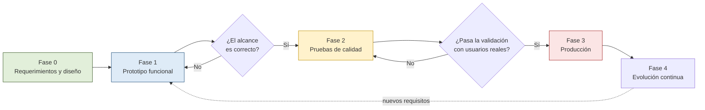

# 08 — Plan de iteraciones

**Versión:** 1.0 · 2 de agosto de 2026

---

## Panorama

---

## Fase 0 — Requerimientos y diseño

**Estado: completada con la entrega de este repositorio.**

| Entregable | Documento |
|------------|-----------|
| Levantamiento de requerimientos | `docs/01` |
| Arquitectura, patrones y ambientes | `docs/02` |
| Diagrama de flujo | `docs/03` |
| Diagramas de secuencia | `docs/04` |
| Modelo de datos y reglas de seguridad | `docs/05` |
| Guía de despliegue | `docs/06` |
| Registro de deuda técnica | `docs/07` |
| Plan de iteraciones | `docs/08` |

**Criterio de salida:** el solicitante aprueba el documento 01 como línea base.

---

## Fase 1 — Prototipo funcional

**Objetivo:** validar que el alcance es el correcto, con software que funcione de verdad, no
con maquetas.

Se ejecuta en el ambiente `dev`. El alcance corresponde a lo que seleccionaste: núcleo
completo, confirmación y bitácora, programación y recurrencia, y adjuntos de voz e imagen.

### Iteración 1.1 — Cimientos

| Entregable | Requisitos |
|------------|-----------|
| Repositorio con la estructura definida y la integración continua funcionando | documento 02, sección 8 |
| Proyecto `sian-umg-bdm-dev` creado, Blaze activo, alerta de presupuesto configurada | documento 06, etapa C |
| Emuladores corriendo en local con datos sembrados | documento 06, etapa D |
| Capa de dominio en TypeScript: entidades, máquinas de estado y estrategias de recurrencia, con pruebas unitarias | RF-PRG-05..09 |
| Reglas de seguridad con sus pruebas automatizadas | RNF-08 |

**Criterio de salida:** `flutter analyze` y las pruebas pasan en verde en la integración
continua, y las reglas de seguridad rechazan correctamente todos los accesos indebidos.

> Esta iteración no produce nada visible para el usuario, y aun así es la que determina si el
> resto del proyecto será mantenible. Es también la lección más valiosa para tus estudiantes:
> lo que se ve al final depende de lo que no se ve al principio.

### Iteración 1.2 — Autenticación y usuarios

| Entregable | Requisitos |
|------------|-----------|
| Inicio de sesión con Google y con correo/contraseña | RF-AUT-01, 02, 05, 06 |
| Lista blanca institucional y asignación de rol por custom claims | RF-AUT-03, 04 |
| Registro de dispositivo, permiso de notificaciones y notificación de prueba | RF-USR-09 |
| Instructivo de instalación de PWA con detección de iOS | RES-05, R-02 |
| Administración de usuarios, grupos e invitaciones | RF-USR-01..07 |

**Criterio de salida:** cuatro usuarios con roles distintos entran, ven exactamente lo que su
rol permite, y un correo no autorizado es rechazado y queda registrado.

### Iteración 1.3 — Mensajes y entrega inmediata

| Entregable | Requisitos |
|------------|-----------|
| Composición con texto, clasificación y validaciones | RF-MSG-01, 02, 06, 13 |
| Grabación de nota de voz y adjunto de imagen | RF-MSG-03, 04, 05, 07, 08 |
| Envío inmediato con procesamiento por lotes y reintentos | RF-PRG-01, RF-ENT-01..06, 10, 11, 14 |
| Recepción, detalle con reproductor de voz e imagen, e historial | RF-ENT-07, 08, 09, 12 |
| Bitácora escribiendo todos los eventos de este flujo | RF-BIT-01, 02 |

**Criterio de salida:** una alerta urgente con voz e imagen llega a un teléfono Android real y
a un iPhone real, con la aplicación cerrada, en menos de 30 segundos.

### Iteración 1.4 — Programación, recurrencia y confirmación

| Entregable | Requisitos |
|------------|-----------|
| Programación a fecha y hora con manejo correcto de zona horaria | RF-PRG-02, 03, 04 |
| Recurrencia con vista previa de las próximas 10 ocurrencias | RF-PRG-05..09 |
| Despachador con transacción de bloqueo e idempotencia | RF-PRG-12, 13, 14 |
| Job de Cloud Scheduler creado y verificado | RES-04 |
| Suspender, reanudar y cancelar programaciones | RF-PRG-10, 11 |
| Confirmación de lectura con sus tres estados | RF-CNF-01..07 |
| Vista de trazabilidad por mensaje y consulta de bitácora | RF-BIT-05, 07, 08 |

**Criterio de salida:** todos los criterios de la lista de verificación de demostración
(documento 06, etapa E.6) se cumplen, **incluida la prueba de resistencia en iOS**.

### Puerta de decisión al final de la fase 1

Sesión de revisión con el coordinador académico, con el sistema funcionando en vivo. Tres
resultados posibles:

| Resultado | Acción |
|-----------|--------|
| El alcance es correcto | Avanzar a la fase 2 |
| El alcance requiere ajustes menores | Iteración 1.5 correctiva, luego fase 2 |
| El alcance está mal planteado | Volver al documento 01, versión 2, y replanificar |

**Si la prueba de resistencia en iOS falló**, esta puerta no se cruza hasta implementar la
redundancia por correo (DT-03). No se lleva a usuarios reales un canal de alertas que puede
callar sin avisar.

---

## Fase 2 — Pruebas de calidad

**Objetivo:** verificar que el sistema aguanta el uso real, con gente real, en el ambiente
`sian-umg-bdm-qa`.

### Iteración 2.1 — Habilitar el ambiente QA

- Crear `sian-umg-bdm-qa` con Blaze y alerta de presupuesto.
- Configurar el despliegue automático desde `develop`.
- Cargar la lista blanca con los correos de los participantes de la prueba.
- Aplicar el branding institucional que proporciones.

### Iteración 2.2 — Pruebas contigo

Recorrido completo de los 12 casos de uso del documento 01, sección 8, verificando cada
criterio de aceptación. Todo hallazgo se registra como incidencia en GitHub, clasificada
como defecto, mejora o requisito nuevo.

### Iteración 2.3 — Pruebas con catedráticos voluntarios

Entre 8 y 15 participantes, mezclando Android e iOS, durante **dos semanas mínimo**.

| Métrica | Meta |
|---------|------|
| Instalación exitosa de la PWA sin ayuda presencial | ≥ 80% |
| Tasa de entrega de notificaciones | ≥ 95% |
| Tiempo hasta la primera confirmación en una alerta urgente | ≤ 5 minutos |
| Tasa de confirmación a las 24 horas | ≥ 90% |
| Notificaciones perdidas en iOS durante las dos semanas | 0 |
| Primer aviso enviado por un emisor sin capacitación | ≤ 3 minutos (RNF-12) |

### Iteración 2.4 — Simulacro real

Ejercicio coordinado con la institución: alerta urgente de simulacro con voz e imagen,
enviada a todos los participantes sin aviso previo, midiendo tiempo de entrega y de
confirmación de principio a fin.

**Es la prueba definitiva.** Si el sistema no rinde aquí, no está listo para producción, por
muy bien que se vea en las demás pruebas.

### Criterio de salida de la fase 2

- [ ] Todas las metas de la iteración 2.3 alcanzadas
- [ ] Simulacro ejecutado sin fallos de entrega
- [ ] Cero defectos de severidad alta abiertos
- [ ] Cobertura de pruebas ≥ 70% en dominio y aplicación (RNF-15)
- [ ] Documento de deuda técnica actualizado
- [ ] Auditoría de accesibilidad WCAG 2.1 AA aprobada (RNF-13)
- [ ] El coordinador académico firma la aceptación

---

## Fase 3 — Producción

### Iteración 3.1 — Habilitar producción

*Ejecutada el 26 de agosto de 2026.*

- [x] Crear `sian-umg-bdm` con Blaze y alerta de presupuesto. *(24-08-2026; documento 11.)*
- [x] Proteger `main` y exigir aprobación manual en el ambiente `produccion` de GitHub.
- [x] Reglas de seguridad, índices, Storage y las 19 Functions desplegadas.
- [x] CORS del bucket aplicado. No lo hace `firebase deploy` (documento 11, sección 4).
- [x] Sembrar la primera invitación: `eua031989@gmail.com` como COORDINADOR.
- [x] Manuales publicados, con la dirección del sitio resuelta en tiempo de ejecución.
- [ ] Cargar la lista blanca institucional definitiva. *La hace coordinación desde la
      aplicación, por carga masiva.*
- [x] Pagar la deuda **DT-07** (sin observabilidad ni alertas) antes de abrir a todos:
      nadie debe operar producción a ciegas. *Alertas puestas el 26-08-2026; queda el
      indicador de tasa de entrega, que es comodidad y no ceguera.*
- [ ] Pagar la deuda **DT-14** (los correos de recuperación caen en No deseado) antes de
      que la gente empiece a olvidar contraseñas de verdad.

> La deuda que queda abierta, DT-14, no bloquea el arranque con coordinación, que es la
> semana 1 del despliegue escalonado. Sí bloquea la semana 3: el día que se abra a toda la
> institución, alguien va a olvidar su contraseña y el correo de recuperación va a caer en
> No deseado.

### Pendientes para la próxima iteración en desarrollo

*Anotados el 29 de agosto de 2026, después de una semana de puesta en producción con
siete defectos de notificación encontrados a mano.*

**Todo esto se trabaja en `develop` y se promueve por el flujo normal.** Nada se toca
directamente en producción: la semana pasada mostró lo que cuesta.

> **Estado al 29 de agosto de 2026: solo documentado.** Ninguno de estos puntos está
> empezado. No hay código escrito, ni ramas abiertas, ni nada desplegado en ningún
> ambiente. Producción quedó estable y así se deja.
>
> Lo que hay aquí es el análisis hecho mientras estaba fresco —qué falla, por qué, qué se
> descartó y con qué argumento—, para que retomarlo la semana entrante no obligue a
> reconstruirlo. **La decisión de arrancar cada punto es del usuario**, uno por uno o en
> bloque; hasta entonces esto es una lista, no un compromiso.
>
> Cuando se retome: leer primero la ficha completa en el documento 07, porque varias
> traen una advertencia sobre el camino que **no** hay que tomar —el push invisible que no
> existe, el tema oscuro que no se enciende sin verificar contraste, la limpieza de
> dispositivos que borra de más—, y esas advertencias son la parte cara del análisis.

### Correcciones — primero, y se liberan antes de tocar nada más

Algo falla hoy. Se arranca por aquí, se prueba en desarrollo, se promueve y **se libera**.
Hasta que las cuatro estén en producción no se empieza con las mejoras.

| # | Corrección | Estado |
|:---:|---|---|
| C-1 | **DT-26** · el contador se queda encendido en Android | **Corregida el 09/09.** Una notificación solo se cerraba al tocarla; quien abría desde el icono las dejaba puestas, y el lanzador de Android las cuenta. Ahora la aplicación manda al worker cuáles siguen sin leer y el worker retira las demás. **DT-17 pagada con ella**: 14 pruebas donde no había ninguna |
| C-2 | **DT-23 → DT-22** · el canal se pierde solo | **Corregida el 09/09.** Sonda semanal en seco que valida los tokens sin entregar nada, y apartado en la pantalla de coordinación con quién no recibiría un aviso ahora mismo. DT-23 quedó pagada a medias por un límite del SDK, explicado en su ficha |
| C-3 | **DT-18** · dispositivos arrastrados | **Corregida el 09/09.** La misma sonda retira lo que lleva más de sesenta días sin actividad, con el motivo anotado en la bitácora |
| C-4 | **DT-14** · correos de recuperación | **Bloqueada, y no por programación.** Exige un buzón institucional y entradas SPF/DKIM en el DNS de la UMG. Lo que sí se hizo: el aviso en pantalla ahora dice que revise la carpeta de no deseado, que es donde caen |

> **DT-17 — pruebas del service worker — no es una corrección con vida propia: es la
> condición para liberar C-1.** De los siete defectos de notificación, los siete vivían en
> ese archivo y ninguno lo encontró una prueba. El contador ya falló una vez y volvió; sin
> pruebas, la tercera es cuestión de tiempo. Viaja con C-1 y se prueba con ella.

**Cómo se liberan.** Una por una por el flujo normal —`develop` → `qa` → `main`— y no todas
juntas al final. Cada una que llega a producción es gente que vuelve a recibir avisos, y
juntarlas solo aumenta lo que hay que revisar si algo sale mal. DT-24 ya se liberó así, sola
y de urgencia, y funcionó.

### Mejoras — después, y sobre un canal que ya sea confiable

Nada de esto falla: falta. Se empieza cuando las cuatro correcciones estén liberadas.

| # | Mejora | Qué aporta |
|:---:|---|---|
| M-1 | **DT-07** · tasa de entrega en el panel | Hoy, saber por qué siete personas no recibieron el aviso del 7 de septiembre exigió consultar la base de datos a mano. El coordinador debería verlo solo |
| M-2 | **DT-20** · saber en qué ambiente se está | Instalada como aplicación, los tres ambientes se ven iguales. Previene mandar un aviso de prueba a los 22 catedráticos reales |
| M-3 | **DT-28** · manual accesible desde la barra | El manual ya está publicado; falta el botón. Es la más pequeña de todas y la que menos puede romper |
| M-4 | **DT-21** · tema oscuro y preferencia del usuario | El tema ya está construido; falta verificar el contraste antes de encenderlo |
| M-5 | **DT-27** · responder a un aviso | Funcionalidad nueva. Va al final a propósito: primero que lo que ya existe funcione |

> **Por qué las mejoras van después y no en paralelo.** Construir encima de un canal que
> pierde gente solo multiplica el problema. Una respuesta a un aviso que nunca llegó no le
> sirve a nadie, y un panel que informa muy bien sobre un canal roto informa muy bien de
> algo roto.

**Sobre DT-27**, la pregunta era si conviene una pestaña de conversaciones. La
recomendación: para el catedrático **no** —responde dentro del aviso, porque el vínculo con
el mensaje es justo lo que da sentido a la respuesta—, y para el emisor sí hace falta
agregación, pero anclada al mensaje: «3 respuestas» en cada aviso, y un indicador global
para enterarse sin abrir uno por uno. Lo que conviene **no** construir es una mensajería
general de cualquiera con cualquiera, que convertiría un sistema de avisos en un chat. El
detalle, con lo que hay que resolver antes de escribir código, en la ficha del documento 07.

**Sobre DT-28**, el manual ya está publicado y servido por la propia aplicación; lo único
que falta es el botón. Va a la izquierda de recargar, siguiendo el orden razonado de la
barra: salir en el borde, y el manual —la acción más inocua— más lejos de él. Lo que no es
trivial es la accesibilidad: nombre accesible verificado con lector de pantalla, aviso de
que abre pestaña nueva (WCAG 3.2.5), tamaño de objetivo en pantalla estrecha, y la
dirección resuelta desde `location.origin` para no repetir el error de incrustar el
ambiente equivocado.

**Sobre DT-26**, lo único que hay por ahora es el síntoma, y así queda anotado a
propósito: el contador del icono se queda encendido en Android con todo leído, y en iOS no.
No se ha investigado ni tocado nada.

Esa asimetría entre plataformas es lo que más orienta. Si la cuenta de mensajes estuviera
mal, fallaría en las dos; que solo falle en una apunta al **apagado** del contador, que sí
se resolvió de forma distinta en cada plataforma. Es una sospecha razonable y hay que
comprobarla antes de escribir una línea — la ficha del documento 07 deja las cinco
preguntas que conviene contestar primero.

**Y es un contador que ya falló antes**, cuando marcaba dos donde debía marcar uno. Que
vuelva por segunda vez es el argumento más concreto a favor de DT-17: mientras el service
worker no tenga pruebas, cada corrección ahí se sostiene solo en que alguien se acuerde de
probarla a mano en los dos sistemas.

**Sobre DT-18**, hay dos caminos y conviene elegir con cuidado:

  · *Un script de limpieza de una vez*, que deje el dispositivo más reciente por persona.
    Rápido, y arriesgado: borrar tokens a mano puede dejar a alguien sin avisos.
  · *Retirar por antigüedad*, que la limpieza quite también lo que lleve sin actividad
    unos sesenta días. Más lento, pero se mantiene solo y no depende de acertar hoy.

El segundo es el recomendado. La semana pasada ya se aprendió lo que cuesta una limpieza
que borra más de lo que debe.

**Sobre DT-20 y DT-21**, los dos son más baratos de lo que parecen, pero por motivos
distintos:

  · El ambiente ya se puede saber en tiempo de ejecución sin configuración nueva:
    `Firebase.app().options.projectId` devuelve `sian-umg-bdm-dev`, `sian-umg-bdm-qa` o
    `sian-umg-bdm`. **Producción no lleva sufijo**, así que comparar por «termina en `-prd`»
    la dejaría sin identificar. Lo que hay que pensar es el diseño, y conviene al revés de
    lo habitual: **producción sin distintivo** —es lo normal y lo que ven los
    catedráticos— y que griten desarrollo y QA.
  · El tema oscuro **ya está escrito y conectado**; lo apaga una sola línea en `main.dart`.
    Pero encenderlo sin más incumpliría RNF-13: la paleta oscura no está verificada contra
    WCAG 2.1 AA y el escudo pierde definición sobre fondo oscuro. Primero se verifica el
    contraste, después se enciende, y al final se agrega que el usuario pueda elegir.

**Sobre DT-22**, la idea de mandar un aviso de canal cada cierto tiempo **no funciona**, y
vale la pena saberlo antes de intentarlo: en web no existe la notificación invisible. El
navegador exige que todo push termine en algo visible, y si el service worker no muestra
nada lo muestra el navegador con un texto genérico. Repetirlo puede costar la suscripción,
o sea que mataría justo lo que quiere conservar.

Lo que sí es invisible es el **envío en seco** de FCM —`sendEach(mensajes, true)`—, que
valida el token sin entregar nada. El teléfono no se entera y devuelve los mismos códigos
de error que la limpieza ya sabe leer.

Empezar **semanal**, que es el plazo más corto conocido —Safari borra los datos de un sitio
sin instalar que no se toca en alrededor de una semana— y dejar que la sonda anote la
antigüedad de cada token al morir. Con dos o tres meses de datos, la recurrencia se ajusta
con hechos de esta población en vez de con cifras generales.

**Sobre DT-23 y el orden.** Antes de construir el panel conviene preguntarse si el problema
se puede reducir, y sí se puede. Desde el servidor **no hay forma de revivir un token
muerto** —la suscripción vive en el navegador y solo él puede crear otra—, pero el estándar
define `pushsubscriptionchange`: el navegador despierta al service worker cuando rota o
invalida una suscripción, y ahí se puede volver a suscribir sin que la persona se entere.
El service worker de SIAN no lo escucha hoy.

Lo que hay que probar en desarrollo con un iPhone real es si iOS despierta al service
worker con la aplicación cerrada, que es cuando suele morir una suscripción. No está
documentado. **Periodic Background Sync** resolvería el caso completo pero no existe en
Safari, así que dejaría fuera a la mayoría.

Aun con todo funcionando queda un resto que ningún mecanismo web alcanza —desinstalar,
retirar el permiso, un aparato apagado semanas—, y por eso DT-22 sigue haciendo falta como
red. Escaparse del todo pide aplicación nativa, que es DT-01 y DT-02 y cuesta 99 USD/año.

**Y algo que no es una deuda con número pero pesa igual:** cuando se cambie el
identificador de una colección, revisar todo lo que la lee. Cambiar `dispositivos` de
token a instalación dejó a todo el mundo sin notificaciones durante horas porque el lado
que lee siguió usando el identificador del documento. El compilador no puede avisar de
eso: `d.id` sigue siendo una cadena válida.

---

### Iteración 3.2 — Despliegue escalonado

| Semana | Alcance | Objetivo |
|:---:|---------|----------|
| 1 | Coordinación académica y participantes de la fase 2 | Verificar el ambiente productivo con gente que ya conoce el sistema |
| 2 | Una facultad o escuela completa | Detectar problemas de escala y de adopción |
| 3 | Toda la institución | Operación normal |

### Iteración 3.3 — Estabilización

Durante el primer mes:

- Revisión **semanal** del consumo en la consola de facturación. La alerta de 1 USD no
  sustituye mirar los números.
- Revisión de la tasa de entrega y de la bitácora de errores.
- Atención a incidencias reportadas dentro de un día hábil.

### Criterio de salida de la fase 3

Un mes de operación con tasa de entrega sostenida por encima del 95%, costo real de 0 USD y
sin incidencias de severidad alta.

---

## Fase 4 — Evolución continua

Ritmo sugerido: iteraciones de dos semanas.

### Cartera de mejoras candidatas

| Prioridad | Mejora | Origen |
|:---:|--------|--------|
| 1 | Redundancia por correo para mensajes urgentes | DT-03 |
| 2 | Observabilidad y alertas operativas | DT-07 |
| 3 | URLs firmadas para adjuntos | DT-04 |
| 4 | Recordatorio automático a quienes no confirman | RF-CNF-09 |
| 5 | Plantillas de mensajes frecuentes | RF-MSG-14 |
| 6 | Tablero de métricas para la coordinación | RF-ADM-04 |
| 7 | Exportación de bitácora a CSV | RF-BIT-06 |
| 8 | Distribución de APK Android por descarga directa | DT-01 |
| 9 | Encadenamiento criptográfico de la bitácora | RF-BIT-10 |
| 10 | Verificación en dos pasos para el coordinador | RF-AUT-10 |

### Reglas de gobierno del proyecto

1. Ningún requisito nuevo entra sin actualizar el documento 01 y su matriz de trazabilidad.
2. Ninguna funcionalidad se despliega a producción sin haber pasado por QA.
3. Toda deuda técnica nueva se registra en el documento 07 en el mismo pull request.
4. La documentación se actualiza en el mismo commit que el código que la afecta, nunca
   después.

---

## Estimación de esfuerzo

Supuesto: una persona con dedicación parcial, aproximadamente 15 horas semanales.

| Fase | Iteraciones | Esfuerzo estimado | Duración con dedicación parcial |
|------|:---:|:---:|:---:|
| 0 · Requerimientos y diseño | 1 | Completada | — |
| 1 · Prototipo | 4 | 120–160 h | 8–11 semanas |
| 2 · Pruebas de calidad | 4 | 60–80 h | 4–5 semanas, incluidas 2 de prueba con usuarios |
| 3 · Producción | 3 | 40–50 h | 3–4 semanas |
| **Total hasta producción** | **11** | **220–290 h** | **15–20 semanas** |

Estas cifras suponen que el desarrollo lo hace una sola persona. Si incorporas estudiantes al
proyecto, el calendario se acorta pero el esfuerzo total sube por la coordinación: cuenta
entre un 20% y un 30% adicional de horas.

### La ruta más corta a una demostración

Si lo que necesitas es enseñar algo funcionando pronto, el camino mínimo es
**iteración 1.1 + 1.2 + la primera mitad de 1.3**: autenticación, envío inmediato de texto y
recepción con notificación real. Son entre 50 y 70 horas, unas 4 semanas con dedicación
parcial, y ya permite mostrar el valor central del sistema al coordinador académico.
